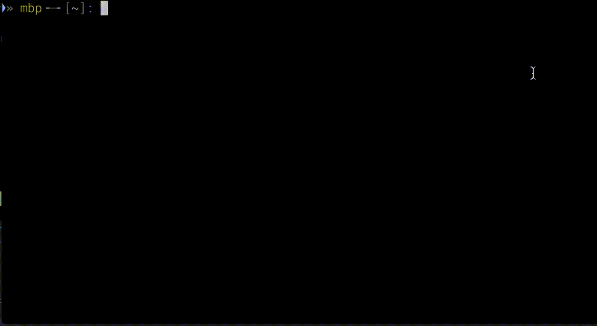
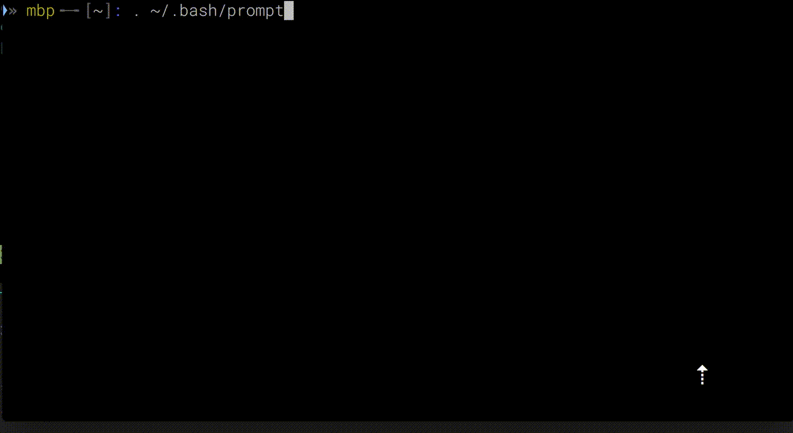

<p>Had a strange behavior in my bash while browsing the command history. I'm always traveling in time with the <code>&lt;Up&gt;</code> arrow in my bash, but when a long command (longer than<em> $COLUMNS</em>) is being loaded, the prompt (<em>$PS1</em>) dissapears and it starts to behave as hell:</p>
<p></p>
<p>After some reserach here and there, as usual, <a href="https://unix.stackexchange.com/a/105974">StackOverflow gave me the answer</a>: the unenclosed non-printable character sequences:</p>
<p></p>
<p>In my case it was exactly like that:</p>

```sh
export PS1="033[1;30m]&raquo; [e[0;33m]mbp033[1;30m]╺─╸[033[1;30m][[033[0m]W[033[1;30m]][033[1;34m]:[033[0m] "
export PS1="[033[1;30m]&raquo; [e[0;33m]mbp[033[1;30m]╺─╸[033[1;30m][[033[0m]W[033[1;30m]][033[1;34m]:[033[0m] "
```

<p>Could you spot the difference?. Please ensure all your non-printable sequences are enclosed in <code>[</code> and <code>]</code> in your prompt before complain about bash doing weird things.</p>
