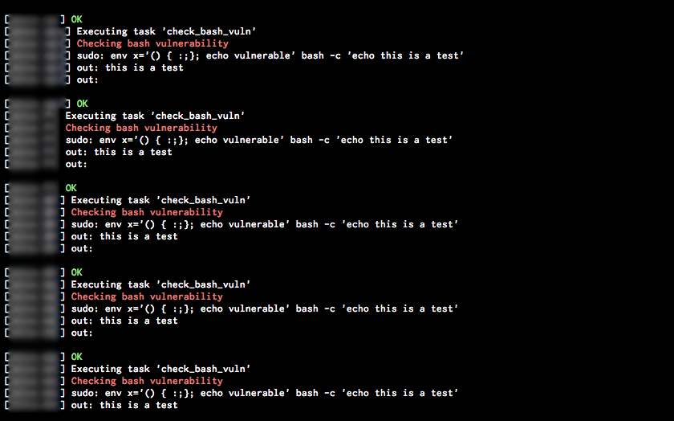

<p>When you wake up in the morning with a new like the <a href="http://www.troyhunt.com/2014/09/everything-you-need-to-know-about.html">bash shellshock bug</a> you should get away your lazy part and update all your servers to new patched version. This is ssh every single server, check the vulnerability, update the package, check again that all is ok and move on to next host.</p>
<p>If you have tons of servers the task becomes tedious. To get a bit of fun you can choose to develop a <a href="http://www.fabfile.org/">Fabric</a> module that makes the job instead of you. The fun:</p>

```
def make_me_a_bashandwich():
    puts(red('Checking bash vulnerability'))
    out = sudo("env x='() { :;}; echo vulnerable' bash -c 'echo this is a test'")
    if "vulnerable" in out:
        puts(red('Vulnerable'))
        puts(red('Updating bash'))
        sudo('apt-get update')
        sudo('apt-get install --only-upgrade %s' % package)
    else:
        puts(green('OK'))
```

<p>Your only job is to run that piece of code in all your servers and take a deep look to the screen:</p>

```
$ fab -H server1,server2,server3 -u root make_me_a_bashandwich
```

<p></p>
<p>In my humble opinion, it's more fun than the old way, isn't it?</p>
<p><span>Image credit: <em>Robert Graham</em>,&nbsp;</span><a href="https://twitter.com/ErrataRob/status/514839781881032705" target="_blank">Twitter</a>.</p>
