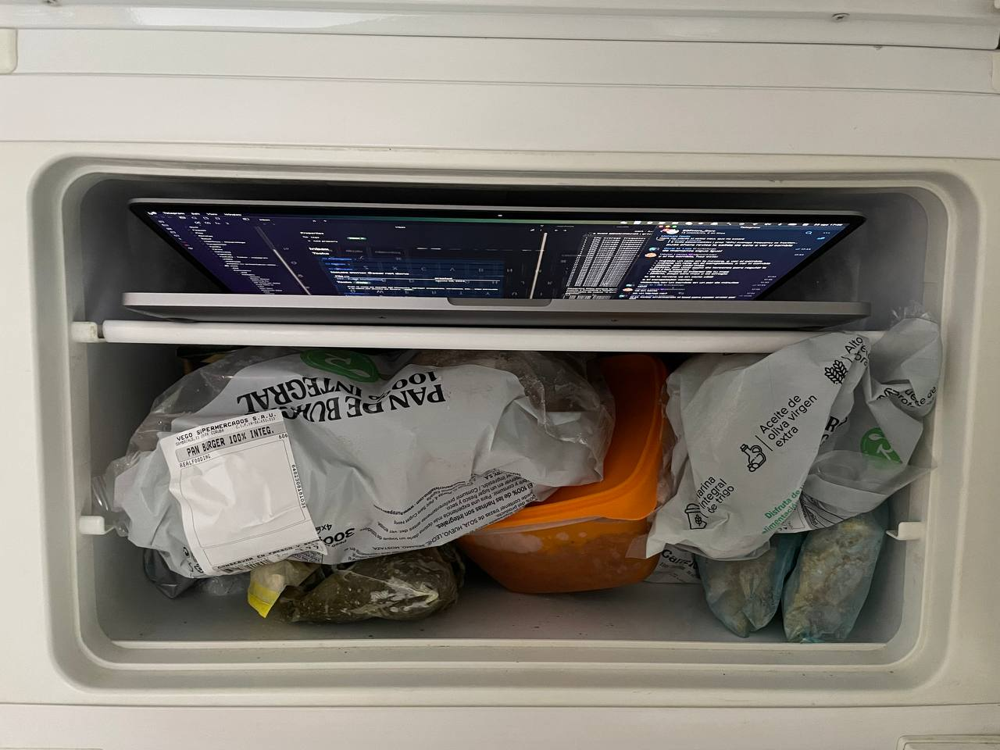

I believe some experiences are too unique not to be shared, and today's one with my computer due to the scorching heat in my city is definitely one of them. Brace yourselves for a quirky yet somewhat educational story: Using your freezer to give your laptop a `60%` power boost. Frozen Apple makes your laptop roar... catchy clickbait, isn't it?

Today was a true summer day, with temperatures soaring around `40°C` outside and ranging from `30°C` to `33°C` in the room housing my computers. In these conditions, it seemed like my Macbook wanted a day off, as even with minimal CPU load, everything was crawling at a snail's pace.

None of the monitoring tools - `top`, `htop`, `System Monitor` - could provide a logical explanation for what was happening. The load average was hovering between 25 and 30 (`!!`), yet no single process seemed to be the culprit.

The CPU/GPU temperatures were stable around `60°C`, and the fans were running at full throttle. At these temperatures, there shouldn't be much cause for concern but the whole system was behaving like the slowest turtle in the world. Everything pointed towards potential *CPU throttling* due to excessive heat.

Indeed, once I was convinced that temperature-related throttling might be the issue, there was only one quirky and amusing way to confirm it quickly: placing my laptop in the freezer. Without hesitation, I rearranged my freezer's contents like a master of Tetris to make room for the laptop in order to achieve a frozen apple (*ba dum tss!*).

Just a couple of minutes in the icy environment were enough to lower the temperature and witness the return of normal performance:

Upon returning to its natural habitat, the laptop gradually warmed up, hitting `55°C`, at which point the fans kicked in at full blast again. However, the temperature continued to rise, stabilizing around `60°C` with the fans working at maximum capacity and throttling once again at `30%`. I'd like to think that being unable to drop below `55°C`, it settled into this state and everything is slow again.

So, there you have it, folks! Nothing like a trusty freezer to unleash the full potential of your Apple device delivering a seamless performance!.

**Note**: No Apple products were harmed in the making of this post. While [#BOFHers](https://bofhers.es) endorses and stands by this technique, the author does not take responsibility for the misuse of the freezer with third-party devices.



