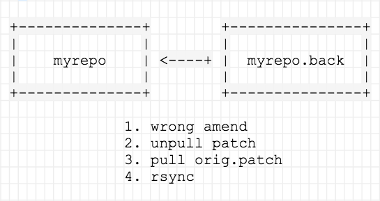

<p>I must admit I often get confused when recording a new patch based on a previous one. Sometimes I <code>amend</code> instead of creating a new record, and once it's done it's not easy to <em>rollback</em>. Well, really it is if you have a backup of the original patch. And this is how I treated to handle it...</p>
<p></p>
<p>First of all, having blundered with the amend, make a repository backup on disk. Once it's done the process should be:</p>
<ul>
<li>Amend other changes to that wrong patch, no matter really, we're going to unpull the patch in next step.</li>
<li>Unpull the patch with the wrong amend.</li>
<li>Pull the original patch (remember, we should have a copy of the original patch -<em>before the wrong amend</em>- to restore it).</li>
<li>Synchronize the repo backup copy to the current one excluding <code>_darcs</code> metadata directory.</li>
</ul>

```
$ cp -r myrepo myrepo.back
$ cd myrepo
$ darcs amend file1 file2
  * patch X
$ darcs unpull
  * patch X
Shall I unpull this patch? (1/1): y
$ dars apply patch-X-original.dpatch
$ cd ..
$ rsync -lprtvvzog --exclude '_darcs' myrepo.back/ myrepo/
```

<p>Now your repo should be exactly as before to make the wrong amend. Once again, the power of the backups is priceless.</p>
