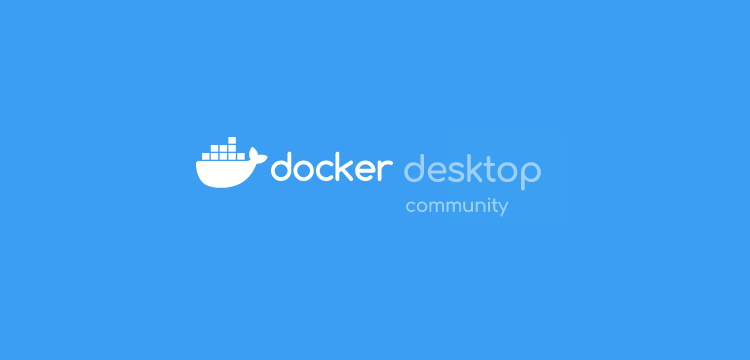

Despues de varias aventuras y - sobre todo - desventuras con <code>brew</code>, he tomado la decisi&oacute;n de minimizar - o intentarlo al menos - que las dependencias de mis m&uacute;ltiples entornos de desarrollo est&eacute;n enganchadas o dependan - valga la redundancia - directamente del gestor de paquetes del sistema, por lo que pueda pasar.

Una decisi&oacute;n que me ha llevado a exprimir <code>Docker</code> un poco m&aacute;s de lo habitual. Pasar los proyectos de desarrollo activos - y los no muertos del todo, con cierta posibilidad de reactivaci&oacute;n - a contenedores est&aacute; siendo divertido y complicado a partes iguales.

Adem&aacute;s de descubrir algunos trucos en relaci&oacute;n al funcionamiento tanto de <a href="https://www.docker.com/">Docker</a> como de <a href="https://docs.docker.com/compose/">Docker Compose</a>, he visto que el rendimiento del mismo en <em>MacOS</em> - sobre todo en temas relacionados con <em>IO</em> - es muy mejorable.

A la hora de crear un contenedor para desarrollo, el concepto de <em>volumen</em>&nbsp;es primordial puesto que se trata del mecanismo que usa <em>Docker</em> para compartir archivos entre el propio contenedor y la m&aacute;quina madre. Por ejemplo si estamos desarrollando un proyecto, querremos que el c&oacute;digo fuente de ese proyecto permanezca en nuestra m&aacute;quina madre o host (<em>MacOS</em> en mi caso) que es donde lanzaremos nuestro editor, pero a la vez ese c&oacute;digo tambi&eacute;n tiene que estar disponbile dentro del contenedo que lo va a servir.

Esto que en teor&iacute;a es tan simple (<code>-v ~/code/proyecto/src:/var/www/html</code>) lleva por debajo un mont&oacute;n de operaciones y l&oacute;gica que hacen que, cuando la cantidad de archivos a compartir entre el host y el contenedor sea medianamente grande (<em>&gt;15k-20k</em>), el rendimiento del servidor <em>dockerizado</em> se vea bastante afectado. Y a d&iacute;a de hoy, entre <code>node_modules</code>, <code>vendors</code> y dem&aacute;s librer&iacute;as de terceros que usamos para cualquier cosa (tanto nosotros directamente como cualquier framework de cualquier lenguaje moderno) es m&aacute;s f&aacute;cil de lo que parece llegar a esos n&uacute;meros y empezar a notar ralentizaciones. Hay un mont&oacute;n de issues al respecto, pero creo que <a href="https://github.com/docker/for-mac/issues/1592">&eacute;sta</a> refleja muy bien el punto en el que est&aacute; el tema.

Por lo que he visto esto no pasa en <em>Linux</em>, sin embargo en <em>MacOS</em> todas las <a href="https://docker-sync.readthedocs.io/en/latest/advanced/sync-strategies.html">estrategias de sincronizado</a> que he probado no han acabado de cuajar, s&iacute; es cierto que algunas mejoran un pel&iacute;n el rendimiento pero ninguna me hab&iacute;a dejado con la boca abierta (<code>osxfs</code>, <code>rsync</code>, <code>unison</code>...).

Hasta que llegu&eacute; a <a href="https://twitter.com/geerlingguy/status/1265763005523996676">este twitt de Jeff Geerling</a> donde dec&iacute;a haber probado un binario de <em>Docker</em> parcheado con <em>Mutagen</em> que hac&iacute;a que los tiempos (en su caso de un <code>composer install</code>) pr&aacute;cticamente se igualaban a los del stack nativo (en su caso <em>LAMP</em> instalado y configurado directamente en <em>MacOS</em>). Mezcla de sentimientos al leerlo, si el bueno de <em>Jeff</em> lo ha probado no creo que sea fake... pero por otro lado demasiado bonito para ser verdad.

As&iacute; que me permit&iacute; la licencia de probarlo en uno de mis proyectos. Para probarlo he tenido que:

<ul>
<li>Descargar e instalar la <a href="https://desktop-stage.docker.com/mac/edge/45418/Docker.dmg">versi&oacute;n Edge de Docker</a> que trae Mutagen <em>builtin</em>&nbsp;(ojo porque se destruir&aacute;n todos los contenedores activos).</li>
<li>Abrir <em>Docker Desktop</em>&nbsp;&gt; <em>Preferences</em>&nbsp;&gt; <em>Resources</em>&nbsp;&gt; <em>File Sharing</em> y agregar ah&iacute; el directorio del volumen a montar que queremos que se comparta con <em>Mutagen</em>.</li>
<li><em>Aplicar</em>, <em>Reiniciar Docker</em> y esperar a que se cachee ese directorio. Al acabar pasar&aacute; a un status "<em>Ready</em>".</li>
<li>Nos aseguramos de que estamos montando el mismo directorio en nuestro <code>docker-compose</code> o en nuestra llamada a <em>Docker</em>.</li>
<li>Levantamos nuestro(s) contenedor(es) y volvemos a <em>Docker Desktop</em>, inspeccionamos el contenedor que deber&iacute;a tener ese volumen montado y comprobamos que el punto de montaje apunta a <code>/var/lib/mutagen/uuid</code> en vez de apuntar a la ruta que hemos especificado al arrancar el contenedor (<code>docker-compose.yml</code> &oacute; script de llamada a <em>Docker</em>).</li>
<li>Una vez hecho esto podemos hacer las comprobaciones necesarias para darnos cuenta de que nuestro volumen ya responde a velocidad casi nativa.</li>
</ul>

En mi caso particular los n&uacute;meros - redondeados en una media de 10 peticiones - hablan de unas velocidades de carga del <em>/dashboard</em> del proyecto tales que los siguientes:

<ul>
<li>Nativo MacOSX ~=&nbsp; &nbsp;<strong>110ms</strong></li>
<li>Docker normal ~=&nbsp; <strong>1000ms</strong></li>
<li>Docker Mutagen ~=&nbsp; <strong>130ms</strong></li>
</ul>

<strong>Nativo MacOS</strong>

<strong>Docker Stable</strong>

<strong>Docker Edge + Mutagen</strong>

<strong>TL;DR</strong>

Docker + Mutagen all the things!. Espero que pronto lo agreguen por defecto a la build oficial, aunque consume un poco m&aacute;s de CPU al hacer el build y de disco (porque tiene que cachear todos eso directorios compartidos) merece mucho la pena y ahorra bastante tiempo en fase de desarrollo.

