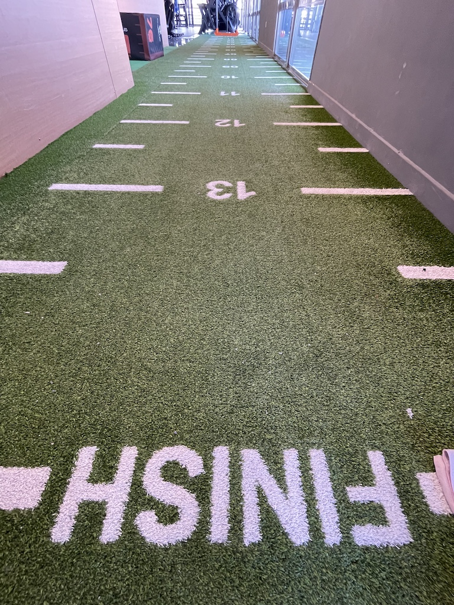

As I sit down to write this post in 2024, I can't help but acknowledge the fact that my blog has remained silent for far too long. It's not for lack of things happening, but maybe because the everyday hustle and bustle have swallowed up my creative energy (or whatever is being called nowadays).

It's simple to miss the little joys in our daily routines. Even without big events, I'm still determined to find that each day presents opportunities to appreciate the simple pleasures and to recognize that our mere existence is a gift worthy of celebration.

In the end, stepping back from blogging reminds us of life's ups and downs. It's often the ordinary moments that stick with us the longest, and it's in these times when we discover the beauty of existence. So, let's embrace the everyday and treasure the little triumphs that give life its meaning.

At the end, this game is all about cycles of streaks... they say!.

