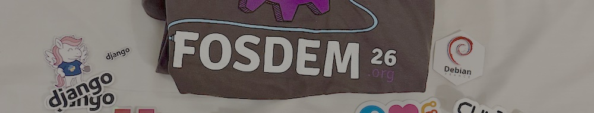

First time at FOSDEM. After all these years reading about it, following the hashtag on social media... I finally got to experience it firsthand. And no, I wasn't prepared for what I was about to find.

Those of you who know me are aware that I don't do well with flights. And of course, there were no direct flights from Galicia, so we had to connect through Barcelona. `LCG-BCN`, `BCN-BRU`, and the same ordeal on the way back. The return flight went better than the outbound one, thankfully. But let me tell you: it was absolutely worth every minute of anxiety. Worth it and then some.

## Organized chaos

Arriving at the ULB and finding thousands of people trying to get into the same talks as you is... chaotic. There's no other word for it. You can't reserve a seat, you don't know if you'll get in, you queue for twenty minutes only to discover the track is full, you turn around and end up in a talk that wasn't even on your radar.

And yet, that chaos has something magical about it. It forces you to improvise, to go with the flow, to discover talks you would never have chosen. I ended up in a session about contributing to FOSS projects that blew my mind, simply because the container track queue was impossible. Sometimes the best plan is having no plan at all.

## Walking among giants

But what really hit me was entering the exhibition area. Python. Django. MySQL. Debian. PostgreSQL. Projects I've been using my entire professional life, right there, with their maintainers behind a table, willing to chat with you like it's nothing.

I wasn't expecting to get emotional about this. I wasn't expecting to feel so moved when I saw the Debian logo up close, when I could personally thank people who have spent decades building the tools I work with every day. Yes, I know, but this is who we are, those of us who've been in this field for years: hopeless romantics of free software who sometimes forget why we started.

FOSDEM reminds you. It reminds you that behind every project there are people, community, hours of selfless work. It reminds you why you chose this path.

## The real treasure: the people

And then there's the best part of all. The team-building with my new colleagues.

This trip coincided with an important career change in my life. New company, new projects, new faces on video calls. But knowing someone through a screen is one thing, and sharing Belgian beers and costillas while debating whether GitOps is overrated is something else entirely.

I met many of them in person for the first time right there, in Brussels. We queued together, got lost around campus, argued about talks, had dinner in unlikely places. These experiences create bonds that no daily standup can ever create.

## A turning point

FOSDEM 2026 has been much more than a technical event for me. It's been a turning point of sorts. The closing of one chapter and the beginning of another.

I'm leaving Brussels with a backpack full of stickers, a head full of ideas, and a heart full of gratitude. Gratitude for the FOSS community that welcomes us, for the new colleagues who already feel close, for this job that allows us to live experiences like this. And gratitude to this flymate that pushed - almost forced - me to get the flights and the hotel. I'd also like to thank the other mate that shared the trips with me and experienced my fear of flying firsthand.

See you at FOSDEM 2027. It won't be my first time anymore, but I'm sure it will still be just as special.


