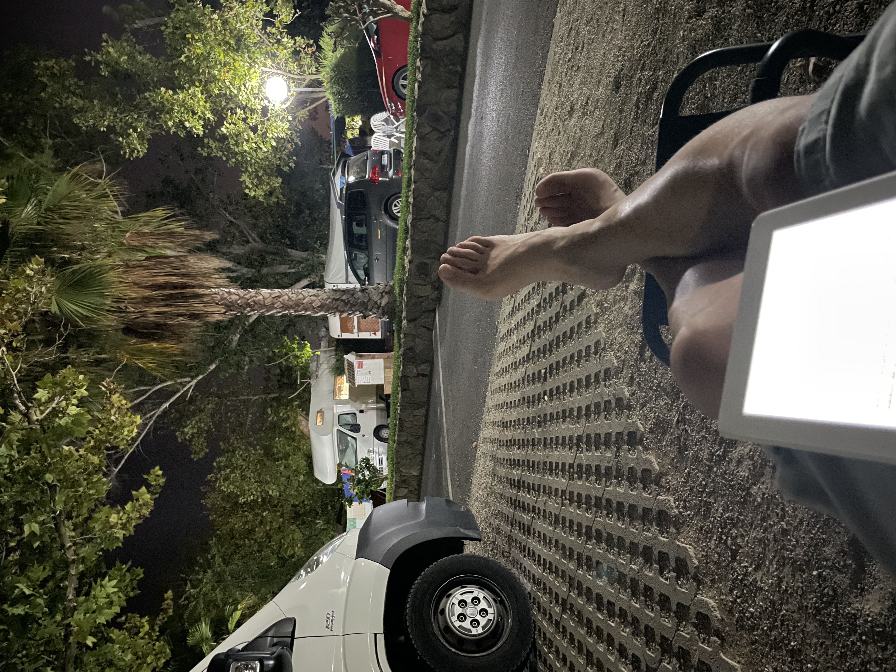

Everyone I know enjoys taking vacations, having free time, spending time with family, and doing different things that the daily grind might not allow for, etc.

As much as I love disconnecting during this leisure time, due to the nature of my work, I always need to have a data plan and some gadget on hand that allows me to remotely connect to servers, if only to be able to restart a service that’s acting up.

For several seasons now, the `iPad` has become my travel companion for these tasks, and this year has been no different.

However, I had another, more fun challenge in mind. Between swimming and lounging, I take the opportunity to read, and my mind shifts into creative mode. More than once, I’ve thought about writing a few lines for this blog. But since it’s a static content manager that I can’t install or build on the  `iPad`, things get a bit more complicated.

So, the reason for writing these lines is to test whether I could accomplish this fun challenge—*even with a photo!* Challenge unlocked.

Enjoy your leisure time.

