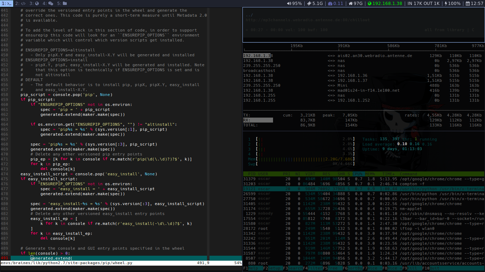

Hace unos d&iacute;as publicaba en el blog <a href="../../../../thinkpad-x220.html">una entrada dedicada al x220</a>. Lo curioso es que ha generado m&aacute;s <a href="https://twitter.com/oscarmlage/status/821442478750519301">ruido</a> por el <em>window manager</em> que por la propia m&aacute;quina, as&iacute; que entre unas cosas y otras casi me he visto obligado a publicar mi configuraci&oacute;n del <a href="https://i3wm.org">i3wm</a>.

Me gustar&iacute;a destacar que estoy muy acostumbrado a ciertos atajos de teclado, as&iacute; que en lugar de adaptarme a los builtin de <em>i3</em>, he intentado amoldarlo a los defectos del animalito.

Habitualmente trabajo con 4 &oacute; 5 escritorios virtuales, el primero de ellos dedicado enteramente a la linea de comandos, el segundo a picar c&oacute;digo, el tercero al navegador, el cuarto a la mensajer&iacute;a en general (correo, im, etc...) y un quinto (opcionalmente) para alg&uacute;n gestor de ficheros u otros menesteres no tan comunes.

Paso el d&iacute;a saltando de escritorio en escritorio, as&iacute; que lo m&aacute;s sencillo es asociar los cursores de direcci&oacute;n izquierda-derecha con ese movimiento y, a partir de ah&iacute;, configurar el resto de forma que no se pisen demasiado. Si adem&aacute;s quiero manterner una cierta compatibilidad (o ergonom&iacute;a) entre los de OSX - que tengo que seguir usando - el asunto se complica un poco.

En este punto es donde entra toda la potencia de Linux e i3, entre xmodmap y las posibilidades de configuraci&oacute;n del window manager, se hace realmente flexible la configuraci&oacute;n, por muy especial que seas, como yo.

Pues eso, gracias a los que hab&eacute;is compartido vuestra configuraci&oacute;n conmigo desde la anterior entrada, y aqu&iacute; os dejo <a href="https://gist.github.com/oscarmlage/3e4ee63160246dfc60a136a7e92bccaf">un enlace a la m&iacute;a</a>. Cualquier duda, comentario o sugerencia, por supuesto, es bienvenida. &iquest;Te animas a compartir tu configuraci&oacute;n de escritorio?

