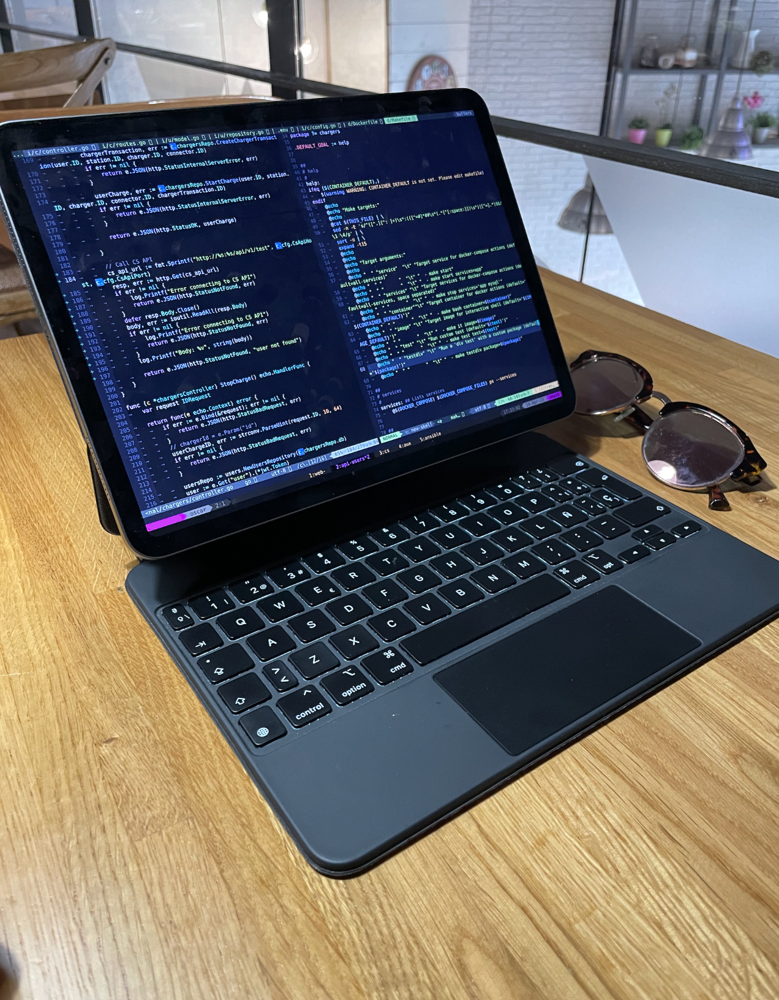

Have you ever considered using an `iPad for coding`? While an iPad may not be the most obvious choice for developers, it can serve as a valuable complement to your main development setup, thanks to its long battery life, portability, and superb keyboard. As a developer, I've found myself drawn to the idea of using an iPad for light development tasks, despite its limitations. In this blog post, I'll share my experience of developing on an iPad, including the tools and apps I use, the pros and cons I've encountered, and my overall reflections on this unconventional approach to coding. Join me as I explore the possibilities and challenges of using an iPad as a coding tool.

When it comes to coding on an iPad, having the right tools and apps can make all the difference. Here are some ideas and the apps that have helped me overcome the limitations of `iPadOS` and enable a productive coding experience:

- **VPN**: When coding on the go or away from home, a VPN is essential for accessing all your resources securely. I rely on the [OpenVPN](https://openvpn.net) app for iPad to connect to my personal VPN server, but other options like [Tailscale](https://tailscale.com), [ExpressVPN](https://apps.apple.com/us/app/expressvpn-1-trusted-vpn/id886492891), [CyberGhostVPN](https://apps.apple.com/us/app/cyberghost-vpn-wifi-proxy/id583009522), [Private Internet Access VPN](https://apps.apple.com/us/app/private-internet-access-vpn/id955626407) are also available.

- **SSH**: Since my tooling is primarily remote, all I need is a reliable terminal that supports SSH connections. [Blink](https://blink.sh) has been my go-to choice, offering seamless SSH connectivity on the iPad. [iSH](https://ish.app) and [Termius](https://apps.apple.com/us/app/termius-terminal-ssh-client/id549039908) are also worth checking out.

- **DNS**: If you, like me, rely on `Docker` for your development environment and need to resolve local domains, iPadOS lacks a direct way to modify the `/etc/hosts` file. However, you can hack it using a `socks server` and `SSH` with `-D` option to resolve requests on the destination host. This workaround has allowed me to resolve local domains, such as [https://localproject.lc](https://localproject.lc/), for my Docker projects.

- **Editor and other tools**: My coding setup includes essential tools like `tmux`, `neovim`, `bash`, `curl`, `siege`, `lazygit`, `Docker`, `mutt` and more. While these tools may require some setup and configuration in the remote host you're using, they provide a powerful coding environment over SSH.

- **Mosh** (optional): Last but not least, for enhanced stability and speed, [Mosh](https://mosh.org) (_Mobile Shell_) has become a must-have for my server connections. Blink also supports Mosh connections, making it a convenient option for a more reliable and faster remote coding experience.

With the right tools and apps, an iPad can be a capable companion for coding on the go, despite its limitations. Let's dive into the pros and cons of developing on an iPad and explore the unique possibilities it offers.

When it comes to using an iPad for development, there are several advantages that make it a compelling choice for many developers. From impressive battery life to unparalleled portability, the iPad offers a unique experience that can enhance your coding workflow. Additionally, the touch screen functionality adds a new dimension to the development process, providing new possibilities for interaction. In this section, I'll highlight some of the main pros of using an iPad for development, based on my own experiences and observations.

1.  **Battery Life**: Despite not being designed for heavy development work, the iPad's battery life is impressive. With around `8 hours` of development work on a single charge, it's more than enough for most coding sessions. (Please note that my dev sessions on the iPad are typically not more than `a couple of hours`).
    
2.  **Portability**: The iPad's portability is a standout feature, especially when compared to larger laptops like the 16-inch MacBook Pro. It's `easy to carry around` and set up in different work environments, making it a convenient option for developers on the go.
    
3.  **User Experience**: There's something about the experience of opening an iPad and starting to work on it that's different from a regular laptop. It's hard to put into words, but `it feels less cumbersome and more efficient`, with a lack of laziness in getting started.
    
4.  **Touch Screen**: The iPad's touch screen adds a new dimension to the development process. While not a primary input method, I've found myself trying to imitate some of those gestures on my MacBook, which seems like a sign that I miss those. The occasional use of gestures for scrolling or other basic tasks `can be helpful` and may even influence your interactions with other devices.

However, like any device, the iPad also has its limitations when it comes to development. While it offers unique advantages, there are some challenges and trade-offs that developers may encounter. In this section, I'll highlight some of the main cons of using an iPad for development, based on my own experiences and observations.

1.  **Limited toolset**: One of the challenges of using an iPad for development is that you may not have access to all the tools and software you're used to on a traditional laptop or desktop. 

2.  **Browser limitations**: The iPad's browser may have some limitations compared to desktop browsers. For example, certain advanced features or developer tools may be unavailable or restricted in functionality. This can impact your ability to thoroughly test and debug web applications, and may require you to work around these limitations or find alternative solutions.

3.  **Adaptation to remote toolset**: If you're using an iPad for development like me, you'll be working with remote tools and servers, which can require you to adapt to a different workflow. For example, using SSH or remote terminals to access your development environment, which can have a learning curve if you're not already familiar with these tools. This can impact your productivity and may require additional time and effort to get accustomed to the remote toolset.

4.  **Changes in shortcuts and workflows**: The iPad's touch-based interface and different keyboard layout compared to a traditional laptop or desktop may require you to learn new shortcuts and workflows. This can impact your muscle memory and productivity, as you may need to re-learn or adapt your familiar shortcuts and workflows to the iPad's touch-based interactions.

In conclusion, while the iPad has its limitations and may not be the ideal choice as a dedicated development machine, it can still be a valuable tool for certain scenarios and use cases.

Would I buy an iPad exclusively for development? No, based on my experience, I would opt for a more portable development machine and consider something more compact than the 16-inch MacBook Pro I own. However, if I already had an iPad, I would definitely try to equip it with the appropriate tools for development. Not for long coding sessions, but for those idle moments when I'm waiting for my kids after school, or when I'm running errands with my partner and inspiration strikes off-screen, or to break the monotony of working from home and heading to a coffee shop to finish that feature... for all those occasions, the iPad is a great option.


