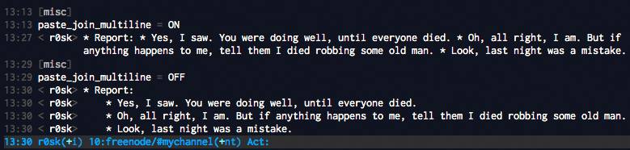

<p>It's not quite known that some of us are still using irc as main channel for projects. I have to admit that without <a href="http://en.wikipedia.org/wiki/Internet_Relay_Chat">irc</a> wouldn't have been able to talk with many interesting people, even lead developers in great opensource projects. So I've much to thank to that 'oldie' protocol.</p>
<p>As a text based service, irc wouldn't have been the same without text clients as <a href="http://www.irssi.org/">irssi</a>, one essential in my day-by-day. After many years using it, I've just discovered that I can disable a feature that "helps" me when pasting stuff:</p>

```
paste_join_multiline = ON
```

<p>"<em>Irssi will try to concatenate multiple lines into a single lined message when these lines have the same indentation level and look like they were copied out of Irssi. It's useful for quoting e-mail or other large-text messages, but it will probably bite you if you try to pasted indented text, such as code listings. Irssi will join multiple lines of code, destroying any structure you wanted to preserve.</em>" (<a href="http://www.irssi.org/documentation/settings#paste_join_multiline">http://www.irssi.org/documentation/settings</a>)</p>
<p>Mostly I want to paste pieces of code, reports, etc... as is, i.e.:</p>

```
* Report:
    * Yes, I saw. You were doing well, until everyone died.
    * Oh, all right, I am. But if anything happens to me, tell them I died robbing some old man.
    * Look, last night was a mistake.
```

<p>But the <code>paste_join_multiline = ON</code> feature is doing it in a wrong way:</p>

```
* Report: * Yes, I saw. You were doing well, until everyone died. * Oh, all right, I am. But if anything happens to me, tell them I died robbing some old man. * Look, last night was a mistake.
```

<p>Annoying, isn't it?. Now that we know how to fix it, let's try it again:</p>
<p></p>
<p>So, you know, <code>/set paste_join_multiline = OFF</code> may become your best friend.</p>
