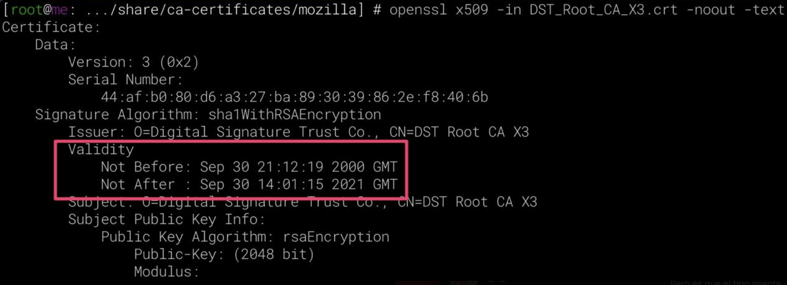
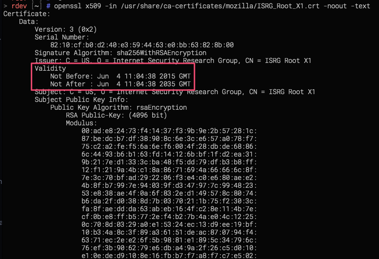

<p>And it happened, yesterday (30th September, 2021), the root certificate that <abbr title="Lets Encrypt">LE</abbr> was using expired. How should I deal with this?. Well, it depends. If your OS is recent probably you just need to update the package where the <code>ca-certificates</code> are, but total different story if your OS is as old as WW1.</p>

<p>In my case I've a <em>Debian7</em> using and comsuming some <abbr title="Lets Encrypt">LE</abbr> certs in both ways so I woke up this morning with the smell of alert in the atmosphere. After reading some literature&nbsp;<a href="https://scotthelme.co.uk/lets-encrypt-old-root-expiration/">here</a> and <a href="https://letsencrypt.org/certificates/">there</a> and talked about it with some mates, decided to manually update the certificate. I was forced to proceed in that way because the package updates for <code>deb7</code><span> are totally out of date (or even closed I'd say).</span></p>

<p>We can see the error here:</p>

```bash
$ openssl s_client -host oscarmlage.com -port 443 -showcerts
CONNECTED(00000003)
depth=2 C = US, O = Internet Security Research Group, CN = ISRG Root X1
verify error:num=20:unable to get local issuer certificate
verify return:0
```

<p>So, first step is to allocate the file where the&nbsp;<code>LE</code> cert is: <code>DST_Root_CA_X3.crt</code>, placed in <code>/usr/share/ca-certificates/mozilla/</code>. Once we found it we can ensure that dates are the root of the issue, we're looking for <a href="https://censys.io/certificates/0687260331a72403d909f105e69bcf0d32e1bd2493ffc6d9206d11bcd6770739/openssl">this one</a> (<code>openssl x509 -in DST_Root_CA_X3.crt -noout -text</code>):</p>
<p></p>
<p>Ok, we're on the way, next step is to find out where is the equivalent cert in some other more recent Debian (maybe a VM can help here), we're looking for <code>ISRG_Root_X1.crt</code> in <code>/usr/share/ca-certificates/mozilla/</code>, we can ensure it's the one we're looking for <a href="https://censys.io/certificates/6d99fb265eb1c5b3744765fcbc648f3cd8e1bffafdc4c2f99b9d47cf7ff1c24f/openssl">here</a>&nbsp;(<code>openssl x509 -in ISRG_Root_X1.crt -noout -text</code>):</p>
<p></p>
<p>Take a look to the <code>X509v3 Subject Key Identifier</code>, in both cases (<code>DST_Root_CA_X3.crt</code> and <code>ISRG_Root_X1.crt</code>) it should have the same key:</p>
<ul>
<li><code>C4:A7:B1:A4:[...]:60:85:89:10</code></li>
</ul>
<p>Now that we already have them handy, we need to copy the good one, remove the older other in the affected machine and refresh the certificates:</p>

```bash
$ scp user@newerhost:/usr/share/ca-certificates/mozilla/ISRG_Root_X1.crt /usr/share/ca-certificates/mozilla/
$ mv /usr/share/ca-certificates/mozilla/DST_Root_CA_X3.crt /tmp/
```


```bash
$ echo "/usr/share/ca-certificates/mozilla/ISRG_Root_X1.crt" &gt;&gt; /etc/ca-certificates.conf
$ vim /etc/ca-certificates.conf
  # remove the /usr/share/ca-certificates/mozilla/DST_Root_CA_X3.crt line
$ update-ca-certificates --fresh
Clearing symlinks in /etc/ssl/certs...done.
Updating certificates in /etc/ssl/certs... 171 added, 0 removed; done.
Running hooks in /etc/ca-certificates/update.d....done.
```

<p>And we can test if it works now:</p>

```bash
$ openssl s_client -host oscarmlage.com -port 443 -showcerts
CONNECTED(00000003)
depth=2 C = US, O = Internet Security Research Group, CN = ISRG Root X1
verify return:1
depth=1 C = US, O = Let's Encrypt, CN = R3
verify return:1
depth=0 CN = oscarmlage.com
verify return:1
```

<p>Of course, best approach in this kind of stuff is proceed with the proper update, upgrade, etc... but not always is doable/possible - there are many reasons I won't mention now -. So I hope this post helps if you're in a situation where the updates are not the solution.</p>
<p>Note, the certs itselves (the old and the new one) can be found here:</p>
<ul>
<li><a href="https://censys.io/certificates/0687260331a72403d909f105e69bcf0d32e1bd2493ffc6d9206d11bcd6770739/openssl">DST_Root_CA_X3.crt </a></li>
<li><a href="https://censys.io/certificates/6d99fb265eb1c5b3744765fcbc648f3cd8e1bffafdc4c2f99b9d47cf7ff1c24f/openssl">ISRG_Root_X1.crt</a></li>
</ul>
<p>Cheers!</p>
