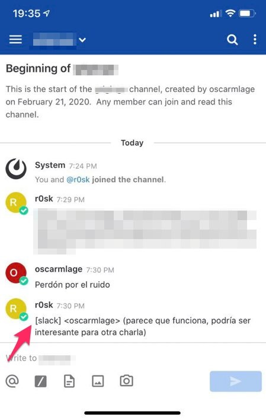

<p>When you are a kind of <em>old school</em>, modern times means a bit of pain in some way. Your soul is mostly seeking inner peace but on the other hand, as someone that works with technology, you wouldn't stay freeze.</p>
<p>And sometimes the thing is the other way around, it feels that the <em>old-school-world</em> you're living with is good but not as great as it should and you need to move a bit forward yourself to - <em>wrongly</em> - have a feeling of progress.</p>
<p>As i've said many times, we're using irc as communication tool for a project. It perfectly fits our needs but if I'd asked to compare with some other tools I would say that there are a couple of holes that can't easily be covered:</p>
<ul>
<li>There is no easy way to share a photo, picture or screenshot.</li>
<li>You need to be always-on if you don't want to miss parts of the conversation.</li>
<li>Definitely IRC is not mobile friendly.</li>
</ul>
<p><strong>About first point</strong> - sharing graphical stuff - well, you can use <a href="https://imgur.com/">imgur</a> or some other similar tools and paste the link, that's what we do, but in the end - as good slackers we are - you think it twice if it's worth the effort. I'm not saying that it's bad think it twice but most of times this <em>upload-to-wherever</em> method does not work with me.</p>
<p><strong>Always-on</strong> is an implicit feature in most of instant messaging apps nowadays. You enter a channel/group and from now on you will get every single message wrote there. IRC does not work in that way, you have to be connected to be able to read the conversation. When you disconnect your client you can't receive messages. So if you get disconnected, you lose the log and the ability to reply. Even if you're not connected people does not see you around and in the end they don't write to you because you can't read (that's not bad, you can choose when you will attend and when you won't).</p>
<p><strong>Lastly, we have smartphones now</strong>, we should be able to reply from anywhere... but mobile connections are not so stable / reliable, in the end it means lots of disconnections here and there, it's not usable.</p>
<p>What can we do? To deal with the disconnections and the always-on stuff we can use something like <code>ssh</code> + <code>tmux</code> + <code>irssi</code> (irc client). That means install an irc client (<code>irssi</code>) in a stable server, access to it over <code>ssh</code> and play a bit with background/foreground modes with a terminal multiplexer (<code>tmux</code>, <code>screen</code>...).</p>
<p>Now we have the <em>almost-perfect</em> cocktail, right?. Well... now you're running it always, you are not losing parts of the conversation, you can even choose when you're ready for interact with the others or <em>away-from-keyboard</em> (<code>afk</code>) and - with some other stuff like the one I've mentioned in <a href="../../../../irssi-hilighting-your-nick.html">my last post</a> - you can also get notifications when people will mention you. So what's wrong?.</p>
<p>The wrong part is that, using the mentioned stuff, you need to be a real <em>old-school 1337 r35p3c73d hax0r</em> to be able to interact if you are not in front of a <strong>real</strong> computer with a <strong>real</strong> keyboard. When you get a mention in your smartphone and want to reply, or just want to read the backlog because you're waiting for a haircut, you have to open a mobile ssh client, pray for stability of the connection, enter the host, attach the detached tmux, go to irssi session/window and deal with the keys and shortcuts. That's all.</p>
<p><strong>Here is where mattermost and matterbridge enters to solve our problem</strong>.</p>
<p><a href="https://mattermost.com/">Mattermost</a> is an Open Source Slack clone, it's a centralized messaging platform that enables secure team collaboration. It's written in <em>Golang</em> and <em>React</em> and runs as a single <em>Linux</em> binary with <em>MySQL</em> or <em>PostgreSQL</em>. To be honest, it's another instant messaging piece of software, but as it's Open Source it has so many free plugins to <a href="https://integrations.mattermost.com/">integrate with almost everything</a> (<em>github</em>, <em>gitlab</em>, <em>docker</em>, <em>ansible</em>, <em>jenkins</em>, <em>jira</em>, <em>nagios</em>, <em>redmine</em>, <em>trello</em>, <em>zabbix</em>...). Of course it has clients for every existing platform nowadays (<em>Linux</em>, <em>Windows</em>, <em>MacOS</em>, <em>iOS</em> and <em>Android</em>).</p>
<p><a href="https://github.com/42wim/matterbridge">Matterbridge</a> is a tool that bridges between a growing number of protocols (<em>mattermost</em>, <em>IRC</em>, <em>gitter</em>, <em>xmpp</em>, <em>slack</em>, <em>discord</em>, <em>telegram</em>, <em>rocketchat</em>, <em>steam</em>, <em>twitch</em>, <em>ssh-chat</em>, <em>zulip</em>, <em>whatsapp</em>...).</p>
<p>So, if we are able to put some glue here and some configurations there maybe with a bit of effort we could solve our little problem:</p>
<ul>
<li>Install a Mattermost server + Create Team and Channel that will receive all the irc messages</li>
<li>Install Matterbridge + Configure Matterbridge to connect <em>1)</em> irc, <em>2)</em> mattermost and <em>3)</em> gateway between 1) and 2)</li>
</ul>
<p><strong>Install a Mattermost server</strong></p>
<p>As slackers, laziness is the strength that moves us so we are going to use docker for both (mattermost and matterbridge) directly in command line (we should prepare our database before, I told you I was old-school so I don't go for a db-container this time):</p>

```bash
docker run -d 
    -p 8000:8000 
    -e MM_SERVICESETTINGS_SITEURL="&lt;https://mymattermost.domain.com&gt;" 
    -e MM_SQLSETTINGS_DRIVERNAME=mysql 
    -e MM_SQLSETTINGS_DATASOURCE="mysqluser:mysqlpass@tcp(192.168.1.2:3306)/dbname?charset=utf8mb4,utf8&amp;readTimeout=30s&amp;writeTimeout=30s" 
    -v /home/docker/mattermost/config:/mattermost/config:rw 
    -v /home/docker/mattermost/data:/mattermost/data:rw 
    -v /home/docker/mattermost/logs:/mattermost/logs:rw 
    -v /home/docker/mattermost/plugins:/mattermost/plugins:rw 
    -h mattermost01 
    --name mattermost01 
    --restart always 
    mattermost/mattermost-prod-app
```

<p>Once it's installed we need to create the team and the channel that will receive the messages from irc, take a look to the final urls once the channel is done:</p>
<ul>
<li>https://mymattermost.domain.com:8000/<strong>myteam</strong>/channels/<strong>mychannel</strong></li>
</ul>
<p><strong>Install Matterbridge</strong></p>
<p>For installing matterbridge we should have a configuration file that says to the binary where to connect and what to do with the messages, so first of all we will create our <code>matterbridge.toml</code> file:</p>

```bash
[irc]
    [irc.freenode]
    Server="irc.freenode.net:6667"
    Nick="matterb0t"

[mattermost]
    [mattermost.mine]
    Server="mymattermost.domain.com:8000"
    NoTLS=true
    Team="myteam"
    Login="deb0t"
    Password="mattermost-password-for-deb0t"

[[gateway]]
name="gateway1"
enable=true
    [[gateway.inout]]
    account="irc.freenode"
    channel="#debian"

    [[gateway.inout]]
    account="mattermost.mine"
    channel="mychannel"
```

<p>Attending to this file, matterbridge will try to:</p>
<ul>
<li>Connect <a href="http://irc.freenode.net">irc.freenode.net</a> with nick <code>matterb0t</code> and enter channel <code>#debian</code></li>
<li>Connect <a href="http://mymattermost.domain.com">mymattermost.domain.com</a> with nick <code>deb0t</code> to the workspace of team <code>myteam</code></li>
<li>As gateway, will try to send all the messages of first inout (<code>freenode #debian</code>) to the second inout (<code>mattermost mychannel</code>).</li>
</ul>
<p>So, it's time to run the bridge:</p>

```bash
docker run -d 
    -v /home/docker/matterbridge/matterbridge.toml:/matterbridge.toml 
    -h matterbridge01 
    --name matterbridge01 
    --restart always 
    42wim/matterbridge
```

<p>And there it goes, if there are no errors we should be able to receive IRC messages in our mattermost channel. Even we can send messages to the IRC from our mattermost client (<em>web</em>, <em>macos</em>, <em>ios</em>, <em>android</em>...) and scroll back without any kind of problems.</p>
<p>Dunno if it's black magic but for me - now that I have a seriously active project running over IRC - it will mean a really nice improvement.</p>
<p></p>
