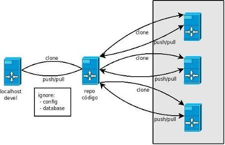

<p>Cuando trabajamos con servidores de versiones seguro que hay muchas razones de peso de por medio, una de ellas -la que veremos- puede ser la replicaci&oacute;n de c&oacute;digo en diversas m&aacute;quinas. <br /><br /> Supongamos un mont&oacute;n de m&aacute;quinas que comparten el mismo c&oacute;digo de repositorio, el orden de propagaci&oacute;n de un cambio en todas esas m&aacute;quinas es sencillo: <br /><br /></p>
<ol>
<li>Programamos dicho cambio en nuestro servidor de desarrollo (<em>devel</em>).</li>
<li>Hacemos un <em>commit</em> local (en sistemas de versionado distribuido -como Mercurial- cada repositorio tambi&eacute;n es servidor).</li>
<li>Lo siguiente es un <em>push</em> al servidor donde almacenamos el c&oacute;digo (<em>repo c&oacute;digo</em>).</li>
<li>Ahora tocar&iacute;a entrar en cada una de esas m&aacute;quinas en las que queremos propagar el c&oacute;digo y ejecutar un <em>hg pull ; hg update</em>.</li>
</ol>
<p><!--more--> Tedioso cuando el n&uacute;mero de m&aacute;quinas que se manejan tiene dos cifras. Intentemos automatizar todo el proceso a trav&eacute;s de las opciones que nos ofrece <a href="http:/mercurial.selenic.com/">Mercurial</a>. <br /><br /> Combinando la <a href="/342_ssh_sin_password.html">confianza entre equipos</a> por ssh y los <a href="/mercurial-hook-on-push.html">hooks de mercurial</a> podemos crear un monstruo sencillo de manejar.</p>
<div class=""center"></div>
<h2>Local/Devel</h2>
<p>En la copia local lo primero que tenemos que hacer es un <em>clone</em> del repositorio <em>padre</em> y definir los archivos que vamos a ignorar. Por ejemplo los archivos de configuraci&oacute;n de base de datos o de peculiaridades locales de cada proyecto en producci&oacute;n (idioma, usuarios, themes, datos de usuario, im&aacute;genes...):</p>

```
[devel] # cat repo/.hgignore
syntax:  glob
.hgignore
config.php
bd.php
.project
uploads*
```

<p><strong>Nota</strong>: una buena pr&aacute;ctica ser&iacute;a no agregar esos ficheros que estamos ignorando al repositorio, podemos agregar unos <em>config-example.php</em> o algo as&iacute; para tener una referencia pero no las configuraciones en s&iacute; -<em>imho</em>-. <br /><br /> A la hora de hacer un <em>pull</em> al repositorio del c&oacute;digo todos los archivos que concuerden con los patrones escritos en el fichero <em>.hgignore</em> no se agregar&aacute;n al repositorio. <strong>Ojo</strong>: el fichero <em>.hgignore</em> debe estar en el ra&iacute;z del repositorio y debe pertenecer al mismo usuario que vaya a hacer el pull.</p>
<h2>Repo c&oacute;digo</h2>
<p>Aqu&iacute; es donde viene la <em>chicha</em>. Te&oacute;ricamente en el repositorio del c&oacute;digo no habr&iacute;a demasiado que tocar, sin embargo es aqu&iacute; donde ejerceremos la mayor automatizaci&oacute;n del proceso. Para propagar los cambios a las m&aacute;quinas en producci&oacute;n podemos hacerlo de dos formas: <br /><br /></p>
<ol>
<li>Como hac&iacute;amos antes, entrando en cada m&aacute;quina en producci&oacute;n y hacer pull del repositorio del c&oacute;digo</li>
<li>Desde el repositorio del c&oacute;digo hacer push a todas las m&aacute;quinas en producci&oacute;n</li>
</ol>
<p><br /> Este punto ha sido el que m&aacute;s me ha costado entender, digamos que dependiendo de la direcci&oacute;n en la que se ejecute el <em>pull/push</em> los resultados son los mismos. Con lo que, si desde el repositorio del c&oacute;digo ejecutamos lo siguiente, los cambios se propagar&aacute;n a las m&aacute;quinas 1, 2, 3 y 4:</p>

```
[repo] # hg push ssh://usuario@maquina1/repo
[repo] # hg push ssh://usuario@maquina2/repo
[repo] # hg push ssh://usuario@maquina3/repo
[repo] # hg push ssh://usuario@maquina4/repo
```

<p>Tuneando un poco el <em>repo/.hg/hgrc</em> del repositorio podemos <em>acortar</em> el comando e intentar automatizarlo un poco m&aacute;s, fijaos:</p>

```
[repo] # cat repo/.hg/hgrc
[paths]
maquina1 = ssh://user@maquina1/repo
maquina2 = ssh://user@maquina2/repo
maquina3 = ssh://user@maquina3/repo
maquina4 = ssh://user@maquina4/repo
```

<p><strong>Ojo</strong>: el fichero <em>hgrc</em> debe estar dentro del directorio <em>.hg/</em> del repositorio y debe pertenecer al mismo usuario que vaya a hacer el pull. <br /><br /> De forma que para ejecutar el comando de propagaci&oacute;n a todas las m&aacute;quinas tendremos que hacer un:</p>

```
[repo] # hg push maquina1 ; hg push maquina2 ; hg push maquina3 ; hg push maquina4
```

<p>Ya tenemos los <em>push</em> automatizados, &iquest;y los updates del lado de <em>producci&oacute;n</em>?. Vamos a ello.</p>
<h2>M&aacute;quina producci&oacute;n</h2>
<p>Cada vez que una de estas m&aacute;quinas recibe un <em>push</em> del repositorio de c&oacute;digo, mercurial debe actualizar los datos con un <em>hg update</em>. Para hacerlo autom&aacute;ticamente en cada <em>push</em> -ya lo hemos visto <a href="../../../../mercurial-hook-on-push.html">en otro post</a>- en el repositorio de cada una de las m&aacute;quinas en producci&oacute;n configuramos el <em>repo/.hg/hgrc</em> de forma que:</p>

```
[hooks]
changegroup = hg update
```

<p><strong>Ojo</strong>: el fichero <em>hgrc</em> debe estar dentro del directorio <em>.hg/</em> del repositorio y debe pertenecer al mismo usuario que vaya a hacer el pull.</p>
<h2>Proceso</h2>

```
 - Programamos en "devel" y guardamos cambios.
 - [devel] # hg commit
 - [devel] # hg push
 - [repo] # hg push maquina1 ; hg push maquina2...
pushing to ssh://user@maquina1/repo
searching for changes
pushing to ssh://user@maquina2/repo
searching for changes
...
```

