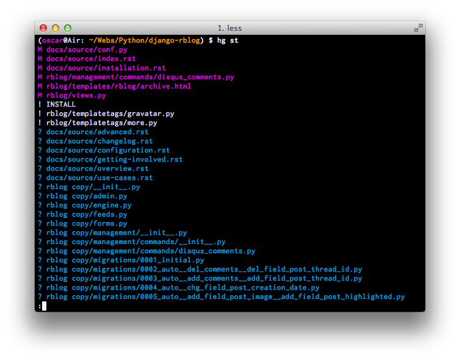

<p>Sometimes when you are using <a href="http://mercurial.selenic.com/">Mercurial</a> you want to paginate the output results. With <em>paginate</em> I mean use someting like bash <em>more</em> or <em>less</em> commands. Trying to focus yourself in a long list display is nearly imposible without a pager, so you can do it <em>old-school-style</em>:</p>

```
$ hg st | more
$ hg st | less
```

<p>Or you can activate the Mercurial <a href="http://mercurial.selenic.com/wiki/PagerExtension">PagerExtension</a>, easy peasy:</p>

```
[extensions]
pager=

[pager]
pager = LESS='FRX' less
attend =
ignore = help
```

<p>Once you have saved theese lines on your <em>~/.hgrc</em>, all the Mercurial commands will be paged. Remember that,&nbsp;by default,&nbsp;<em>PagerExtension</em>&nbsp;only works with <em>annotate</em>, <em>cat</em>, <em>diff</em>, <em>export</em>, <em>glog</em>, <em>log</em> and <em>qdiff</em> commands. If you want it to be run with all the commands you have to add the "<strong><em>attend=</em></strong>" line. On the other hand, if you want to ignore some commands you can specify that with the "<em>ignore</em>" option as you can see in the above sample.</p>
<p></p>
<p>More information about the PagerExtension and Mercurial in general:</p>
<ul>
<li><a href="http://www.userlinux.net/mercurial-colores-y-pager.html">Mercurial, colores y pager (Spanish) on Userlinux</a></li>
<li><a href="http://mercurial.selenic.com/wiki/PagerExtension">PagerExtension oficial site</a></li>
<li><a href="http://stackoverflow.com/questions/7598558/mercurial-pager-extension">Mercurial PagerExtension on StackOverflow</a></li>
<li><a href="http://stackoverflow.com/questions/1869040/what-are-the-best-and-must-have-hg-mercurial-extensions">Must have Mercurial extensions on StackOverflow</a></li>
</ul>
