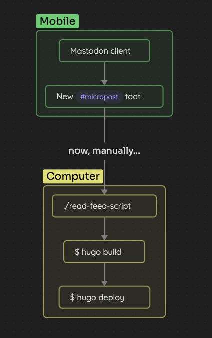
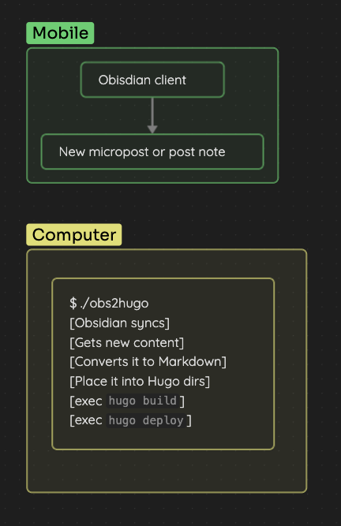

The other day, I raised [through Mastodon](https://mastodon.bofhers.es/@oscarmlage/112235259493996614) what I call «the problem of microposting»  and tried to find a solution that could cover my use case minimally.

Microposting is a brief and agile way of publishing "stuff" easily and with minimal friction. Platforms like *Tumblr*, *Twitter*, or recently *Mastodon* have made microposting a reality that moves more dynamic and updated content than other types of publications.

When it comes to reducing friction in content generation, we have to say that the clients of these platforms are very usable and make it very easy to create a text accompanied by several photos to document any kind of situation. Even if it's temporary content, it's very easy and quick to generate.

Since I left *Twitter* (deleting all the history of the account) and joined *Mastodon*, I consider the content on these platforms as **ephemeral**. Almost everything published will lack meaning in the future without proper context, or perhaps only as a historical record to remember or relive certain feelings. (Please note that I haven't programmed expiration on publications yet, but I'm sure I'll end up doing it).

But there are some publications that, either for sentimental or for other reasons that are not relevant, I would like to keep in `[someplace]`. And that's where the questions begin. How can I save that history? Could I "export" it to another site to keep those publications without depending on what happens to the instance or to the third-party company owning the social network? Hasn't anyone thought of this before?

Considering that, in my case, we're talking about exporting certain publications from *Mastodon* to, for example, my blog; my first approach was to create a tag (`#micropost`) that could have an associated feed (thanks to *Mastodon*) and make use of a small script to read that feed to export one by one all the entries and convert them into easily importable markdown content on this blog ([Hugo](https://gohugo.io)). And thus, the `Social` section was born:

- https://oscarmlage.com/microposts/

Over time, I've seen that the flow isn't right, although the creation is very simple and within reach of any device (I literally carry the *Mastodon* client in my pocket), I have to manually run the feed reading script on a computer and also build and deploy the website for the new content to appear. **All the friction that is reduced in content creation reappears in its publication**.

I think it can be improved by changing the tools. And that's what I did. I've created another small (well... not so much) script that I can leave running on any computer that has access to `the input` and `the output` (we'll talk about it now). The script takes care of reading changes on disk in certain directories and acting accordingly. The input is now [Obsidian](https://obsidian.md), which also has a fantastic client, I also carry it in my pocket, and it also allows me to create content without any friction and even with more composition options than *Mastodon*. The output is [Hugo](https://gohugo.io) and the flow is as follows:

1. I open the *Obsidian* client and create a new note in the folder assigned to `microposts`.
2. I write the content, attaching photos, videos, or any other type of content that the Obsidian client allows me. As I'm creating, the content is already synchronizing with the other *Obsidian* instance I have on my PC.
3. The script that is watching the disk alerts changes, translates them into markdown, and moves them to the microposts directory of *Hugo*. Also, it `builds & deploys` in background.

Automatically and without the need to do anything else than generate the content, we have already published it `\o/`.

I think I've managed to reduce friction both in creation and publication to a minimum, and always using my favorite content manager and my favorite documentation tool. Goal achieved. By the way, I've called the script `obs2hugo`, and you can access the source code here:

- [oscarmlage/obs2hugo](https://git.oscarmlage.com/oscarmlage/obs2hugo)

Please note that the script is constantly being updated, as new ideas come to me as I use it. For example, I've just added support for the watcher to observe several different directories and act accordingly, so I can not only manage the `microposts` but also manage the `posts` like this one you're reading, written entirely following this new flow.

<video width="100%" controls><source src="gallery/obs2hugo-sample01.mov" /></video>

<video width="100%" controls><source src="gallery/obs2hugo-sample02.mov" /></video>

Besides having had a couple of super entertaining days with this new toy, I must admit that I'm enjoying it like a kid. I love it.
