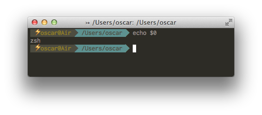

<p>Today I've tried to install <a href="http://ohmyz.sh/">Oh My ZSH!</a> as default terminal and I've resoundingly failed because of a color stuff. I knew I was not good with colors but I didn't know it would affect to terminals... The installation script inserted "<em>/bin033[01;31m033[K/zsh033[m033[K</em>" as my default shell - <em>yep, with all that color crap</em> - and, of course, that strange and colorful binary does not exist in my computer at all.</p>
<p>So I needed to move back to bash the default shell. As <code>sudo -s</code> is not working in OSX, I've taken the other way, to play with <em>Directory Service command line</em> utility aka <code>dscl</code>.</p>
<p>After read a bit the man page I concluded I can <em>-read -change</em>, <em>-delete</em> or <em>-append</em> records, keys and values, so it should be easy to replace <code>zsh</code> with <code>bash</code>:</p>

```
$ dscl . -read /Users/root UserShell
UserShell: /bin033[01;31m033[K/zsh033[m033[K
$ sudo dscl . -change /Users/root UserShell /bin/zsh /bin/bash
$ dscl . -read /Users/root UserShell
UserShell: /bin033[01;31m033[K/zsh033[m033[K
```

<p>Oh, replacement is not working, the fscking color stuff!. Let me give it a second try:</p>

```
$ sudo dscl . -delete /Users/root UserShell
$ sudo dscl . -append /Users/root UserShell /bin/bash
$ dscl . -read /Users/root UserShell
UserShell: /bin/bash
$ sudo dscl . -append /Users/root UserShell /bin/zsh
$ dscl . -read /Users/root UserShell
UserShell: /bin/zsh
```

<p>Phew!, it seems to be ok now, after all I wanted to install <code>zsh</code> as my default user shell, not bash. So, got it after 1 hour instead of 5 mins. You know, color stuff is always mad, God save B&amp;W.</p>
<p></p>
