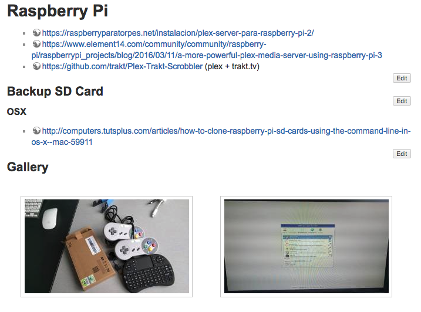
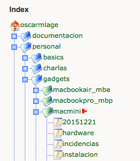

<p>What <em>the perfect documentation platform</em>&nbsp;means for me?. Don't know if <em>perfect</em> is the right word, but there is a tool that gives me all the power I need for this purposes. And what I need?. It's hard to say in a couple of words because along the time the needs have been changing with me. But I will try to summarize some of the must features I'm not able to live without:</p>
<p><strong>Include</strong></p>
<p><em>DRY</em> means "<em>Don't Repeat Yourself</em>". Sometimes while I'm documenting some stuff I realize that it's always the same block of text, for example, adding a new sftp user to a domain. Instead of <em>copy/paste</em> the same text all the time (you can imagine the <em>PITA</em> if there are typos inside and the text was copied &gt; 50 times). It's so nice to be able to do something like:</p>

```
==== Add SFTP User ====
{{page&gt;doc:generic:add-sftp-user&amp;noheader}}
```

<p>If I want to change something I just open the <code>add-sftp-user</code> page and... done! in all the occurrences!. And it is even better, I can include a whole page or only a part of it, with or without the title (header):</p>

```
{{page&gt;doc:generic:add-sftp-user}}
{{page&gt;doc:generic:add-sftp-user&amp;noheader}}
{{page&gt;doc:generic:add-sftp-user#subtitle-inside}}
{{page&gt;doc:generic:add-sftp-user#subtitle-inside&amp;noheader}}
```

<p>Isn't it amazing? I couldn't find something similar outside <em>the tool I'm using</em>, I don't know if there are any other alternatives that can achieve something closer to this using <em>markdown</em>, <em>rst</em> or whatever, someone?.</p>
<p><strong>Gallery</strong></p>
<p>What are you using a gallery for?. Are we still talking about documentation?. Yes we are, I really like to write all kind of documentation, not only tech one. Sometimes I like to grab some screenshots of the Desktop, Preferences of a certain software, or some real photos of the new gadget I bought, it's nice to take a look to this kind of information after a while. How to deal with it?. Well, it's really easy when you have a Media Manager to upload the pics, then you only have to write something like this in the place you want to insert a gallery:</p>

```
{{gallery&gt;pics:gadgets:macmini:*.png }}
```

<p>And, of course, you are plenty of options to play with the photos, sizes, crops.. even a lightbox gallery.</p>
<p></p>
<p><strong>Outline / Table of Contents (TOC)</strong></p>
<p>When you are writting large documents, they should be structured in sections and subsections, what I expect from a tool that tries to help me in the documentation, is the ability to <em>automagically</em> generate this table of contents. Most of the tools I know does it by default, nothing to say. Almost:</p>

```
~~NOTOC~~
```

<p>In <em>the tool I'm using</em> if you add this string in the end of the document, the <em>TOC</em> won't be generated (helpful in short documents or in pieces just created to be included in bigger documents). Amazing.</p>
<p><strong>Search</strong></p>
<p>When you are managing &lt; 10 documentation files is not hard to find whatever, but once it grows up a bit the search will be a real nightmare. That's why a builtin search engine makes the difference. Judging from what I've seen out there, there are many options to connect many of the tools with other solutions like <em>Apacle Lucene</em>, <em>Solr</em>, <em>SphinxSearch</em> and similar, but if I'm talking about <em>KISS</em>, this kind of stuff is not for me (for now).</p>
<p>Definitely, a search engine and the ability to choose what to index are a must.</p>
<p><strong>Friendly reading experience</strong></p>
<p><em>Friendly</em> is a really big word. For me it would mean just open the files in an editor and read the documentation, but probably that's not the definition of <em>friendly</em> from the point of view of the customer. The perfect tool should have something like a web frontend to properly render the syntax of the documentation.</p>
<p><strong>Shortcuts to go anywhere</strong></p>
<p>I'm really used to the <code>folder/</code> + <code>file(s)</code> structure because it's what I have been using since the first time I took a keyboard. For me the documents fits perfectly in this kind of structure:</p>

```
docs/
  personal/
  work/
    project1/
    project2/
      specifications.txt
      roadmap.txt
      web.txt
```

<p>If I want to go to the <em>project2</em> documents I can just use the terminal (<code>cd docs/work/project2</code>), but if I am browsing the web frontend, an index collapsable and expandable tree would be the best solution. And if I can give access to the customer with her own user to the folder of the project it would be just perfect!.</p>
<p></p>
<p><strong>Portability</strong></p>
<p>What's the ultimate purpose of write documentation? To read it. It has to be available in all possible scenarios. For me it would be ideal just to have the files and folders synced across all the devices where it's supposed to be read, and in some of them, even the requirements to launch the web frontend.</p>
<p>To be honest this one is the weak point of my tool. If I want to take with me the readable version of the docs I need a web server + a virtualhost pointing to the software, plus some other required operations as maintain the software, backups, etc...</p>
<p>In it's favour there is no database required but some times a web server is still a high price nowadays.</p>
<p><strong>Tools</strong></p>
<p>I have been checking some tools here and there last weeks, not because I'm not happy with my current solution, but having seen the portability problem and, on the other hand, taking in account that I really like the <em>markdown</em> syntax; if there was something similar but <em>markdown</em> based and without the requirement of maintain any piece of software, probably some efforts will have been worthwhile. But I couldn't find anyting. I've considerated:</p>
<ul>
<li><a href="https://jekyllrb.com/">Jekyll</a></li>
<li><a href="http://flask.pocoo.org/">Flask</a> + <a href="https://pythonhosted.org/Frozen-Flask/">Frozen-Flask</a></li>
<li><a href="https://github.com/F1LT3R/markserv">MarkServ</a></li>
<li><a href="http://www.mkdocs.org/">MkDocs</a></li>
<li><a href="http://www.sphinx-doc.org/en/master/">Sphinx</a> (not Markdown but reStructuredText)</li>
<li><a href="https://readthedocs.com/">ReadTheDocs</a></li>
</ul>
<p>But none of them reaches all the minimum viable points I've listed in this entry. So in the end I've decided just to stay where I am because - for me - I have the most appropiate tool: <a href="https://www.dokuwiki.org/dokuwiki">Dokuwiki</a>.</p>
