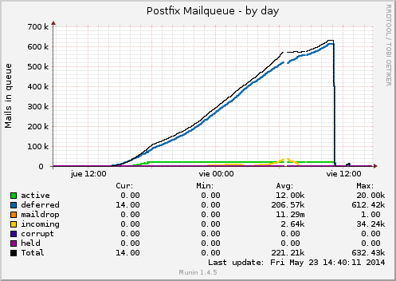

<p>This is a tipical friday story on sysadmin world, starting with a common <em>Munin</em> alert email and ending fighting against a cracked email account due a weak password. The alert referred to a weird problem with inodes outside range in / partition:</p>

```
servers :: our.server :: Inode usage in percent
        CRITICALs: / is 100.00 (outside range [:98]).
```

<p>Inode usage in percent was outside normal range, but <code>df</code> gave me no clue about that strange situation. So after a couple of searches about how to check a directories' list order by inodes usage, I found an <a href="http://stackoverflow.com/questions/653096/howto-free-inode-usage">interesting resource</a> (<em>stackoverflow</em>, of course):</p>

```
# find . -xdev -type f | cut -d "/" -f 2 | sort | uniq -c | sort -n
      9 tmp
     23 lib32
     31 root
     91 bin
    129 sbin
    212 boot
    888 etc
   2929 lib
  27393 usr
2327393 var
# cd /var
# find . -xdev -type f | cut -d "/" -f 2 | sort | uniq -c | sort -n
    245 log
    912 cache
2325393 spool
```

<p>Round one, <strong>MTA</strong> (<em>Postfix</em> in this case) was the main suspect. After playing a bit with&nbsp;<code>mailq</code> I confirmed that something was rotting there, so before restart the service and clear the queue, should find from where the disaster came: external IP or local script.</p>
<p>Dropping port 25 v&iacute;a <em>iptables</em> should resolve the question (<code>iptables -A INPUT -p tcp --dport 25 -j DROP</code>) and there it was, attack stopped. So we configure <em>iptables</em> again to accept pettions -<code>iptables -A INPUT -p tcp --dport 25 -j DROP</code>- and let's see what netstat can show:</p>

```
# netstat -nap | grep ":25" | more
tcp        0      0 192.168.1.25:25         0.0.0.0:*               LISTEN
                2239/master
tcp        0     14 192.168.1.25:25         94.251.111.121:56253    ESTABLISHED
                2310/smtpd
```

<p>After a docen of tries, the fact of ever seeing that IP (<strong>94.251.111.121</strong>) was really annoying, even further in case of a <em>.ru</em> IP so we proceeded with a ban to really confirm the source of the attack.</p>

```
# iptables -A INPUT -s 94.251.111.121 -p tcp --dport 25 -j DROP
```

<p>Attack stopped again, in fact we have found the real offender but... how that machine have obtained that right?. That's the other unknown we must resolve. As we still have the <code>mailq</code> information (remember, we didn't stop the service nor delete the queue), we could proceed with some commands that help us in searching. With <code>mailq</code> we can focus the mail ID, and with<code>postcat</code> we can show the mail details:</p>

```
# mailq
840A4C0FF0  1145 Fri May 23 13:56:34 non-existent@ourdomain.com
(host alt1.gmail-smtp-in.l.googl...
# postcat -q 840A4C0FF0
# postcat -q 840A4C0FF0 | grep sasl_username
named_attribute: sasl_username=email@ourdomain.com
```

<p>We can figure that someone is sending spam with the <em>email@ourdomain.com</em> local account, but the best approach is to see more information than an unique random ID/email:</p>

```
# for i in $(mailq | cut -f1 -d" " | grep -v "(" | grep -v "-" | sort | uniq); do postcat -q $i | grep sasl_username; done
named_attribute: sasl_username=email@ourdomain.com
named_attribute: sasl_username=email@ourdomain.com
...
```

<p></p>
<p>Suspicion confirmed, a weak password was the cause of all that weird situation. So let's change the password, clear the queue and restart the servers. Last task, but not least, is to have a <strong>serious</strong> talk with the proper user.</p>
