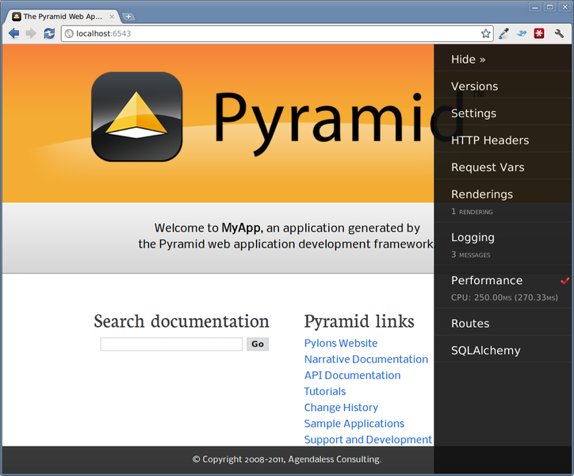

<p>Las series de art&iacute;culos no son lo m&iacute;o, creo que no he llegado a completar las que he empezado, pero hay que intentarlo. Entiendo que con esa premisa ser&aacute;n pocos los arriesgados lectores que lleguen al final, pero es una de las excusas que tengo para ponerme al l&iacute;o con este nuevo reto, as&iacute; que el que avisa...</p>
<p><a href="http://www.pylonsproject.org/">Pyramid</a> es un framework de desarrollo de aplicaciones web en <a href="http://python.org/">Python</a>. Todav&iacute;a no s&eacute; muy bien <a href="http://www.pylonsproject.org/about/history">la historia</a> de c&oacute;mo <strong>Pylons Project</strong> (que era como se llamaba antes) se convirti&oacute; en <strong>Pyramid</strong>; de hecho en la web todav&iacute;a siguen nombr&aacute;ndolo por numerosos sitios como "<em>Pylons Project</em>".</p>
<p>Seg&uacute;n la wikipedia, <strong>Pyramid</strong> es un framework minimalista inspirado en <a href="http://www.zope.org/">Zope</a>, <em>Pylons</em> y <a href="https://www.djangoproject.com/">Django</a>. Originalmente se llamaba <strong>repoze.bfg</strong> (no s&eacute; si antes o despu&eacute;s de llamarse <em>Pylons</em>) y est&aacute; &iacute;ntimamente integrado con <a href="http://wsgi.readthedocs.org/en/latest/">WSGI</a>, <a href="http://www.sqlalchemy.org/">SQLAlchemy</a>, <a href="http://www.zodb.org/en/latest/">ZODB</a>, <a href="https://chameleon.readthedocs.org/en/latest/">Chameleon</a>, <a href="http://www.makotemplates.org/">Mako</a> y muchas otras tecnolog&iacute;as que iremos viendo poco a poco. Lo que nos interesa ahora es empezar por el principio.</p>
<p><strong>Montando el entorno</strong></p>
<p>Ahora que ya estamos algo situados (sobre todo si hab&eacute;is visitado alguno de los anteriores enlaces) vamos a empezar la casa por los cimientos: el entorno de trabajo. Usaremos <em>virtualenv</em>, b&aacute;sicamente porque ya estamos acostumbrados a ello, as&iacute; que hacer entorno ser&iacute;a tan sencillo como escoger un directorio en nuestro equipo y, teniendo <em>pip</em> instalado, instalar las dependencias:</p>

```
$ mkdir PyPetProj
$ cd PyPetProj
$ virtualenv env
$ . env/bin/activate
(env)$ pip install pyramid
```

<p>A la hora de escribir esta entrada se ha insalado&nbsp;la versi&oacute;n <em>1.5a2</em> de Pyramid y todas sus dependencias, podemos ver el entorno y los paquetes instalados en &eacute;l con el comando pip freeze:</p>

```
$ pip freeze
PasteDeploy==1.5.0
WebOb==1.2.3
pyramid==1.5a2
repoze.lru==0.6
translationstring==1.1
venusian==1.0a8
wsgiref==0.1.2
zope.deprecation==4.0.2
zope.interface==4.0.5
```

<p><strong>Iniciando el proyecto</strong></p>
<p>Llegados a este punto ya tendr&iacute;amos lo m&iacute;nimo necesario para empezar nuestro proyecto <em>Pyramid</em>. Normalmente al trabajar con <em>virtualenv</em> empiezo una estructura con 2 directorios al mismo nivel: <strong>env/</strong>&nbsp;que ya hemos creado para el entorno y <strong>src/</strong> para el c&oacute;digo fuente del proyecto en s&iacute;, as&iacute; que seguir&eacute; la misma norma. Antes de crear el proyecto debemos tomar una decisi&oacute;n importante, la base de datos con la que vamos a trabajar.</p>
<p>Los que venimos de <em>PHP</em> o <em>Django</em>&nbsp;ya hemos tenido alguna que otra experiencia con <em>MySQL</em>, <em>PostgreSQL</em> o <em>SQLite</em>, as&iacute; que vamos a intentar algo distinto, usaremos una base de datos orientada a objetos heredada de <em>Zope</em>: la <strong>ZODB</strong>. Tenemos que indic&aacute;rselo a la hora de crear el proyecto:</p>

```
(env)$ pcreate -s zodb src
(env)$ ls
env/ src/
```

<p>Una vez creado el proyecto, tan s&oacute;lo hace falta instalar las dependencias del mismo (dependencias de ZODB y dem&aacute;s) para empezar a programar y ser capaces de lanzarlo con &eacute;xito. Para ello lo registramos como desarrollo y fijaos todo lo que instala:</p>

```
$ cd src/
$ python setup.py develop
[... install ...]
$ pip freeze
BTrees==4.0.8
Chameleon==2.13-1
Mako==0.9.0
MarkupSafe==0.18
PasteDeploy==1.5.0
Pygments==1.6
WebOb==1.2.3
ZConfig==3.0.3
ZEO==4.0.0
ZODB==4.0.0
ZODB3==3.11.0a3
mock==1.0.1
persistent==4.0.6
pyramid==1.5a2
pyramid-chameleon==0.1
pyramid-debugtoolbar==1.0.9
pyramid-mako==0.3.1
pyramid-tm==0.7
pyramid-zodbconn==0.4
repoze.lru==0.6
six==1.4.1
src==0.0
transaction==1.4.1
translationstring==1.1
venusian==1.0a8
waitress==0.8.7
wsgiref==0.1.2
zc.lockfile==1.1.0
zdaemon==4.0.0
zodburi==2.0b1
zope.deprecation==4.0.2
zope.interface==4.0.5
```

<p>Ahora ya podr&iacute;amos lanzarlo y empezar a trabajar en &eacute;l, para lanzarlo usamos la herramienta pserve de la siguiente forma:</p>

```
$ pserve development.ini --reload
```

<p>Y tendr&iacute;amos nuestro servidor de desarrollo ejecut&aacute;ndose por defecto en <em>http://localhost:6543</em>. El pantallazo del proyecto hasta ahora ser&iacute;a algo parecido a la siguiente imagen:</p>
<p></p>
<p>Lo siguiente ser&iacute;a entender la estructura del proyecto, adaptarlo a nuestras necesidades y adentrarnos un poco m&aacute;s en las peculiaridades de ZODB, que no son pocas. Pero eso, con un poco de suerte, ser&aacute; otro d&iacute;a.</p>
