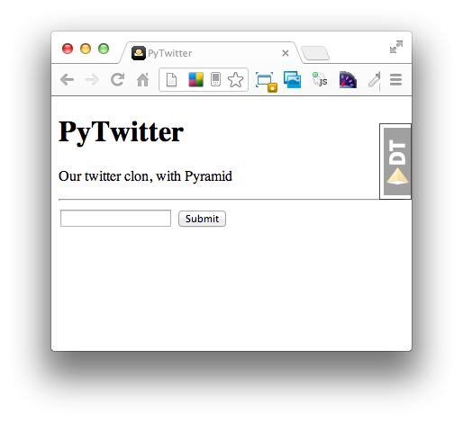
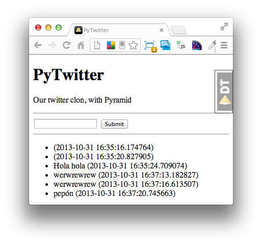

<p>Aunque hasta ahora es cierto que hemos creado un <em>model</em> (bueno, dos), una <em>view</em> y una <em>template</em>, hemos configurado el <em>root context</em> de la aplicaci&oacute;n y sabemos m&aacute;s o menos c&oacute;mo funciona y c&oacute;mo movernos por ella, de momento no hemos interactuado demasiado con el <strong>ZODB</strong>, nos falta agregar datos a ese modelo Twitts que creamos en su d&iacute;a y, obviamente, mostrarlos.</p>
<p>Para agregar datos necesitamos un formulario que mapee el modelo twitt en html y que el usuario pueda interactuar con &eacute;l. Y aqu&iacute; es donde entra en escena <a href="http://pythonhosted.org/pyramid_simpleform/">pyramid_simpleform</a>. Como su nombre indica, se trata de una librer&iacute;a de validaci&oacute;n y render de formularios que deberemos instalar en nuestro entorno:</p>

```
$ pip install pyramid_simpleform
```

<p>Una vez instalada ya podemos crear los formularios correspondientes. Para ello y por seguir alguna convenci&oacute;n, usaremos el directorio schemas/, as&iacute; que creamos dicho directorio, colocamos en &eacute;l un __init__.py y, en principio, vamos a crear el formulario correspondiente al modelo twitt: twitt.py</p>

```
# -*- coding: utf-8 -*-

from formencode import Schema, validators

class TwittSchema(Schema):

    allow_extra_fields = True
    filter_extra_fields = True

    twitt = validators.UnicodeString(max=140)
```

<p>Definido el <em>schema</em> del <em>form</em>, vamos a usarlo en una view, necesitamos importar las clases correspondientes, crear una instancia de ese formulario en base al esquema y pasarlo a template para renderizarlo en html:</p>

```
# views/__init__.py
from pyramid_simpleform import Form, State
from pyramid_simpleform.renderers import FormRenderer
from src.schemas.twitt import TwittSchema
...
def homepage(context, request):
...
    form = Form(request, schema=TwittSchema, multipart=True)
    ....
    return {'form': FormRenderer(form),
            'title': 'PyTwitter',
            'description': 'Our twitter clon, with Pyramid'}
```

<p>En nuestro index.pt agregamos el formulario propiamente dicho y ya deber&iacute;a aparecer algo parecido a lo siguiente:</p>

```
    # templates/index.pt
    &lt;title$&gt;{title}&lt;/title&gt;
    &lt;p&gt;${description}&lt;/p&gt;
    &lt;hr /&gt;
    ${form.begin()}
        ${form.text('twitt')}
        ${form.errorlist('twitt')}
        ${form.submit('submit', 'Submit')}
    ${form.end()}
```

<p></p>
<p>Ahora tan solo nos queda la segunda parte, recoger los datos por POST y agregarlos persistentemente a nuestra ZODB. Para ello comprobamos en view si existe alg&uacute;n dato request.POST y si valida adecuadamente. Finalmente llamaremos al m&eacute;todo add_twitt() del context para que lo agregue a la base de datos:</p>

```
    # views/__init__.py
    if 'submit' in request.POST and form.validate():
        twitt = form.bind(Twitt())
        twitt.published = datetime.today()
        context.add_twitt(twitt)
```


```
    # models/rootfolder.py
    def add_twitt(self, twitt):
        self.add(str(twitt.tid), twitt)
```

<p>Y por &uacute;ltimo, si queremos sacar todos los twitts que hemos guardado, llamaremos a un m&eacute;todo del model que nos los devuelva y el procedimiento es el mismo siempre, pasarlos a template para pintarlos:</p>

```
    # models/rootfolder.py
    @property
    def index(self):
        return [t for t in self.values() if isinstance(t, Twitt)]
```


```
    # views/__init__.py
    ...
    twitts = context.index
    ...
    return {'form': FormRenderer(form),
            'twitts': twitts,
            'title': 'PyTwitter',
            'description': 'Our twitter clon, with Pyramid'}
```


```
    # templates/index.pt
    &lt;hr /&gt;
    &lt;ul&gt;
        &lt;li tal:repeat="twit twitts"&gt;${twit.twitt} (${twit.published})&lt;/li&gt;
    &lt;/ul&gt;
```

<p></p>
<p>Ahora s&iacute; que tenemos nuestra primera interacci&oacute;n con ZODB completa y funcional. Ya podemos agregar nuevos twitts y ver el listado de los mismos. Ahora faltar&iacute;a, de alguna forma, ponerlo un poco m&aacute;s bonito. En la pr&oacute;xima entrada hablaremos de <a href="http://getbootstrap.com/">bootstrap</a>, <a href="http://fortawesome.github.io/Font-Awesome/">fontawesome</a>,&nbsp;<a href="http://bower.io/">bower</a>&nbsp;y&nbsp;<a href="http://webassets.readthedocs.org/en/latest/">webassets</a>.</p>
