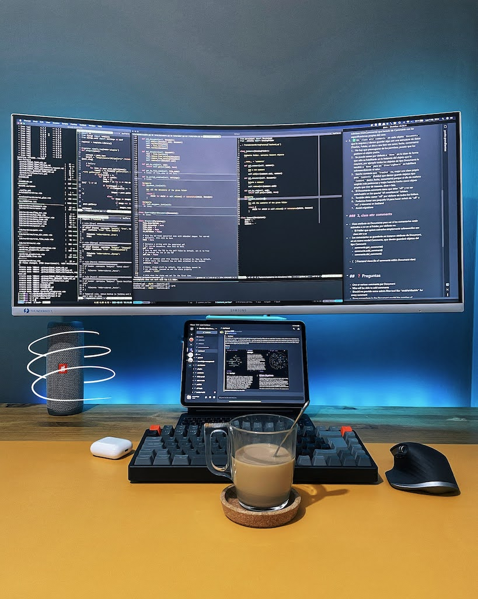
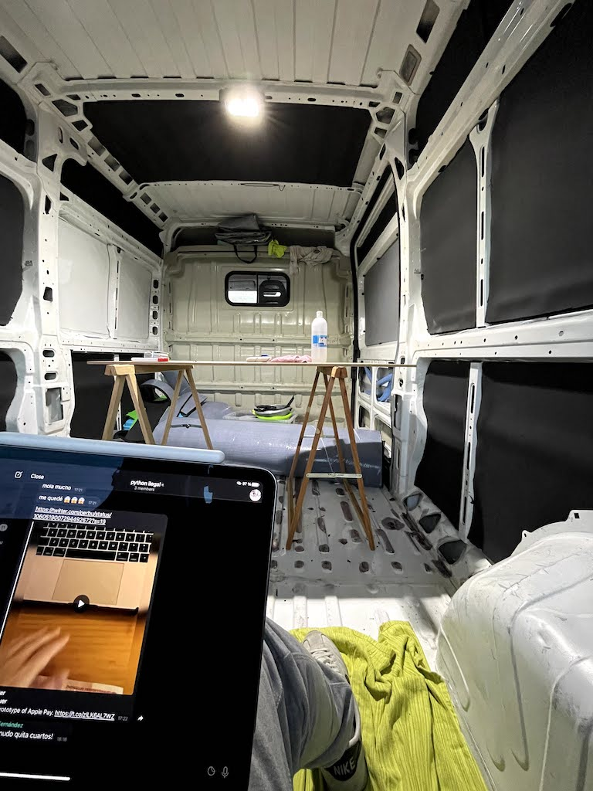

Un par de peque&ntilde;as coincidencias me han empujado a desempolvar esa &laquo;<em>fina capa de mugre</em>&raquo; que recubre el entorno administrativo de este CMS.

 Hac&iacute;a tiempo que no me daba una vuelta por los feeds de la <em>blogosfera</em> (si es que el t&eacute;rmino sigue siendo v&aacute;lido en 2021) y entre que he descubierto que el amigo <a href="https://blackshell.usebox.net/">Juanjo</a> ha abierto <a href="https://www.usebox.net/jjm/blog/">un nuevo blog</a> y que <a href="http://nosolosoftware.com/">Andr&eacute;s</a> me ha dado a conocer los "<em>recently</em>" me he dicho... &iquest;por qu&eacute; no?.

<strong>Blog</strong>

La &uacute;ltima entrada se sit&uacute;a a finales de Mayo, y la anterior en Febrero. Con un total de 4, el 2020 ha sido el peor a&ntilde;o desde 2002, aunque sin que sirva de excusa, tambi&eacute;n ha sido el a&ntilde;o m&aacute;s &laquo;distinto&raquo;. Me he dejado en el tintero el par&eacute;ntesis del 15 de octubre, el decimoctavo cumplea&ntilde;os del blog (imperdonable que no haya apuntado nada en su mayor&iacute;a de edad) y muchas otras cosas que probablemente podr&iacute;a haber comentado pero al final no han tenido lugar. Es lo que hay, tampoco voy a fustigarme por la inapetencia.

<strong>Pandemic</strong>

Quiero suponer que uno de los principales motivos de la mencionada falta de apetencia ha sido la gesti&oacute;n - o mejor dicho la falta de autogesti&oacute;n - de todo esto que est&aacute; pasando detr&aacute;s de las pantallas, en una vida anal&oacute;gica que se ha vuelto m&aacute;s complicada y que ha hecho temblar los cimientos de la sociedad contempor&aacute;nea.

 A algunos nos est&aacute; llevando m&aacute;s de la cuenta el per&iacute;odo de adaptaci&oacute;n a esta nueva normalidad que ha llegado para quedarse.

<strong>Way out</strong>

Hace tiempo ya, recuerdo haber viajado a Venecia con poco m&aacute;s que un sombrero, un l&aacute;tigo y barba de 3 d&iacute;as. Una plaza, una biblioteca y un tropez&oacute;n con una loseta me hizo caer en unas catacumbas bastante t&eacute;tricas. Una vez all&iacute;, s&oacute;lo recuerdo haber pasado semanas enteras intentando encontrar la salida a un pozo lleno de agua que no me dejaba avanzar. &iquest;Alguien recuerda el nombre del juego?.

 Es un buen s&iacute;mil, intentar gestionarse cuando no hay v&iacute;as de escape, o las que hay no son seguras. En el juego al final s&oacute;lo hab&iacute;a que utilizar una botella de vino para reblandecer una antorcha y conseguir moverla para activar una trampilla que te hac&iacute;a caer en el siguiente nivel.

 Lo de la botella de vino ya est&aacute; resuelto, el resto de herramientas est&aacute;n encajando poco a poco en su sitio con el fin de activar esas v&iacute;as de escape / trampillas tan necesarias para avanzar.

 Despu&eacute;s de tantos a&ntilde;os construyendo productos y servicios a base de ceros y unos que flotan en un ciberespacio sideral, me apetec&iacute;a probar algo tangible, as&iacute; que, adem&aacute;s de las t&iacute;picas &ntilde;apas de andar por casa que no merecen mucha menci&oacute;n, decid&iacute; comprar un tablero de madera y poner a prueba mis nulas habilidades de &laquo;<em>woodworking</em>&raquo;. Tengo que reconocer que me ha encantado tanto el proceso como el resultado final.

 Por otro lado, antes incluso de que todo el terremoto covid aterrizara y despu&eacute;s de haber probado un par de veces la experiencia autocaravanista, en casa ya ten&iacute;amos decidido que iba a ser nuestro siguiente paso. Por lo que nos hemos lanzado a la aventura de camperizar una furgo. As&iacute;, sin nunca jam&aacute;s haber hecho nada similar. A&uacute;n est&aacute; todo en pa&ntilde;ales pero estamos disfrutando mucho de cada peque&ntilde;o paso al frente.

 Y esa sensaci&oacute;n de "deber&iacute;a haber hecho este tipo de cosas antes" no se paga con dinero.<strong> </strong>

