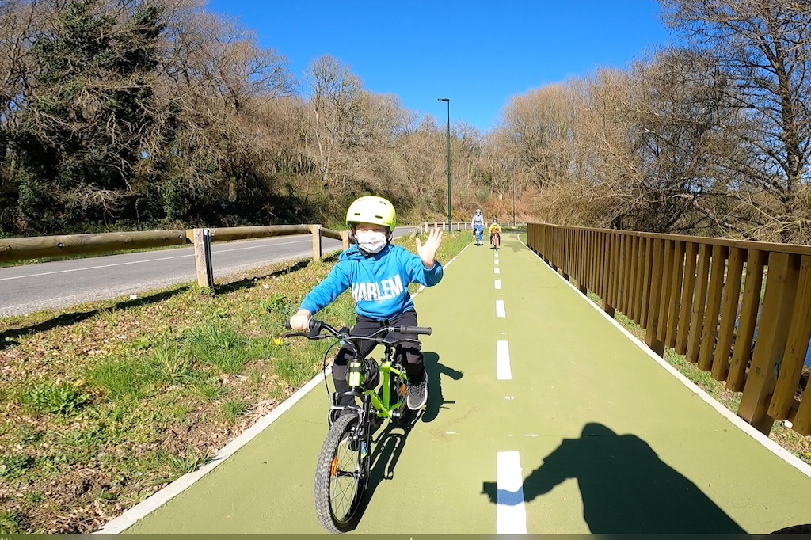
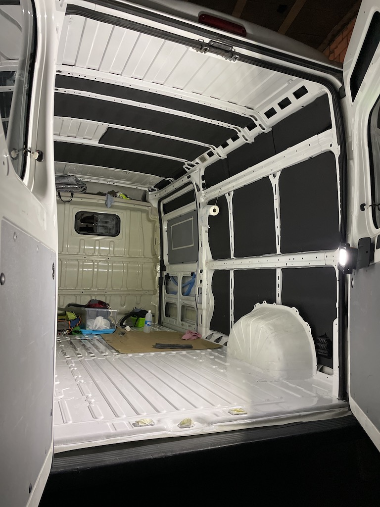
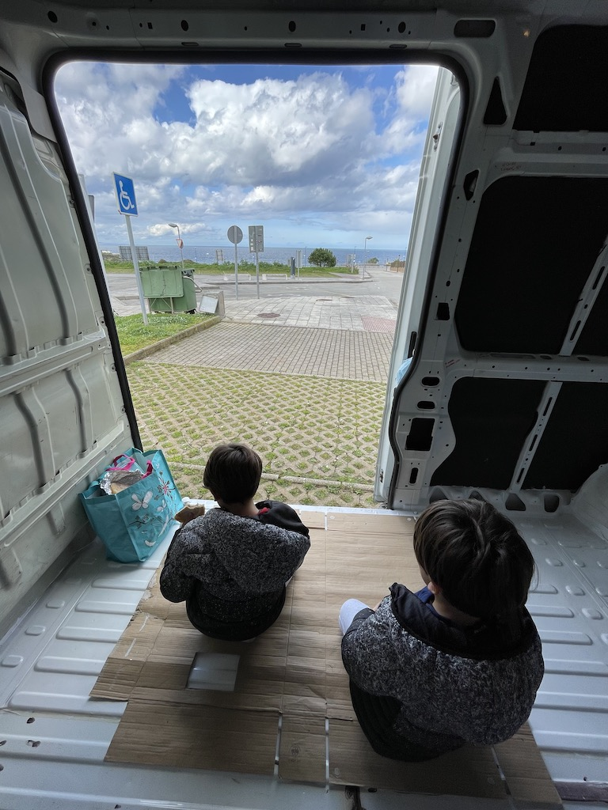
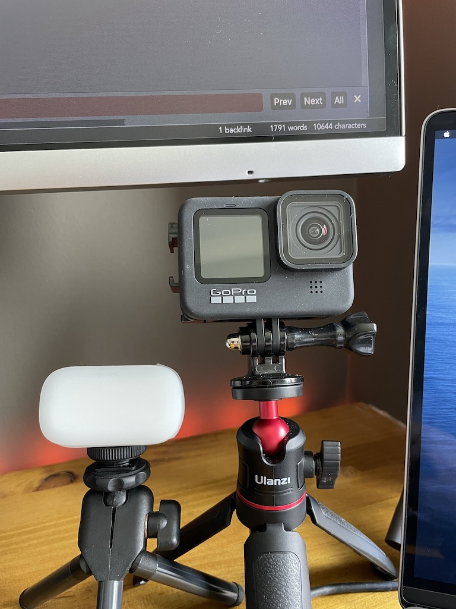
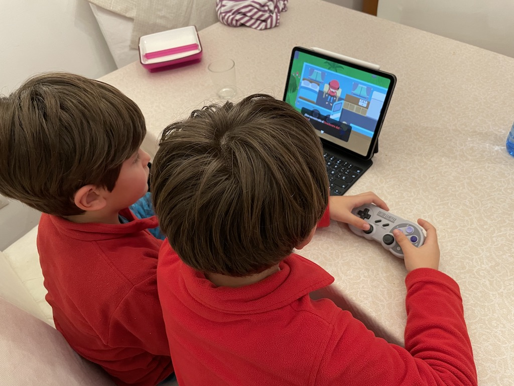

Sigamos tirando del hilo de los <em>recently</em>, son la excusa f&aacute;cil para volver a contar cosas. Le he estado dando vueltas a ver si encajaba mejor una estructura de subtemas m&aacute;s o menos fija o variar seg&uacute;n lo acontecido y creo que de momento me decanto por lo segundo. Aunque todo &uacute;ltimamente se ha vuelto bastante mon&oacute;tono, no quiero que no tener material de un tema en concreto se convierta en un problema para retrasar publicaciones.

<strong>Personal</strong>

En marzo del a&ntilde;o pasado se empezaba a escribir una triste p&aacute;gina en la historia de la humanidad que, entre muchas otras cosas, ha hecho de las videollamadas algo distinto a lo que eran. Creo que a todos nos pas&oacute; un poco lo mismo, comenzamos muy fuerte y las hemos aborrecido. No nos funcionan, como ocio al menos no. Lo hemos intentado de nuevo y est&aacute; muy bien poder ponerse al d&iacute;a, pero nada que ver con el caf&eacute; de toda la vida. Seguro que pronto volveremos.

Otra experiencia nueva - distinta - ha sido el carnaval de este a&ntilde;o. Pese a que en los colegios no hab&iacute;a fiestas, desfiles ni nada parecido, el viernes permitieron a los ni&ntilde;os ir disfrazados igualmente. A mediod&iacute;a, a la salida, se quedaron jugando con sus compa&ntilde;eros de clase un rato en el parque. Para ellos fue la mejor de las celebraciones. Contento porque lo han valorado como un fant&aacute;stico regalo, triste por las circunstancias.

12 Km. Esa ha sido la distancia de nuestro primer gran paseo en bici como familia los 4. A falta de otro tipo de actividad - este mes est&aacute; pr&aacute;cticamente todo cerrado por las nuevas restricciones - hemos decidido dar una "peque&ntilde;a" vuelta de la que he vuelto muy sorprendido, no esperaba ni la mitad.

<strong>Vanlife</strong>

Seguimos avanzando con nuestro proyecto de <em>vanlifers</em> maldiciendo los peque&ntilde;os huecos y los ara&ntilde;azos barra marcas de guerra del aislamiento de la furgoneta. El <em>kaiflex</em> es un gran invento pero nos ha llevado mucho m&aacute;s tiempo del que hab&iacute;amos calculado rellenar cada hueco de los nervios del veh&iacute;culo, as&iacute; que ha sido un poco desesperante. Tambi&eacute;n hemos tratado el suelo a base de lija, convertidor de &oacute;xido e imprimaci&oacute;n, para dejarlo un poco m&aacute;s preparado de cara al futuro.

Y con la &uacute;ltima capa de imprimaci&oacute;n todav&iacute;a fresca hemos hecho nuestro <em>primer viaje</em>, a <a href="https://www.facebook.com/northcampers/">NorthCampers</a>, para que nos preparen toda la <em>obra mayor</em> y seguir sumando. Segunda fila de asientos, instalaci&oacute;n de 220v + 12v + placa solar y boiler de agua. Deseando ver los avances.

<strong>Misc</strong>

Relacionado con todo el tema <em>van</em>, quise grabar un timelapse del aislamiento y cual fue mi sorpresa al intentar encender la GoPro Hero 4 - llevaba parada un par de a&ntilde;os o as&iacute; - que no funcionaba. La bater&iacute;a se hab&iacute;a hinchado <em>dentro</em> de la c&aacute;mara y a&uacute;n despu&eacute;s de operarla con todo el cari&ntilde;o del mundo, no he conseguido revivirla, sniff. Y como tengo en mente grabar todo lo que pueda del proceso de camperizaci&oacute;n, decid&iacute; que pod&iacute;a ser interesante actualizarse.

Por otro lado no est&aacute; siendo un buen momento en cuanto a lecturas / series / juegos, estoy atascado en un par de libros que empec&eacute; en enero, me gustar&iacute;a acabarlos pero parece que nunca encuentro ese rato en el que me apetezca avanzar. En casa hemos decidido hacer uso de los meses de prueba de Apple Arcade por culpa del <a href="https://apps.apple.com/es/app/sneaky-sasquatch/id1098342019">Sneaky Sasquatch</a> y, como experiencia, est&aacute; siendo muy interesante en general jugar a juegos <em>que se puedan acabar</em> y que no requieran de conexi&oacute;n constante a Internet. De todas formas no creo que renueve una vez acabe el per&iacute;odo de gracia.

No ten&iacute;a en la cabeza que febrero hubiera dado para &laquo;<em>tanto</em>&raquo;.

