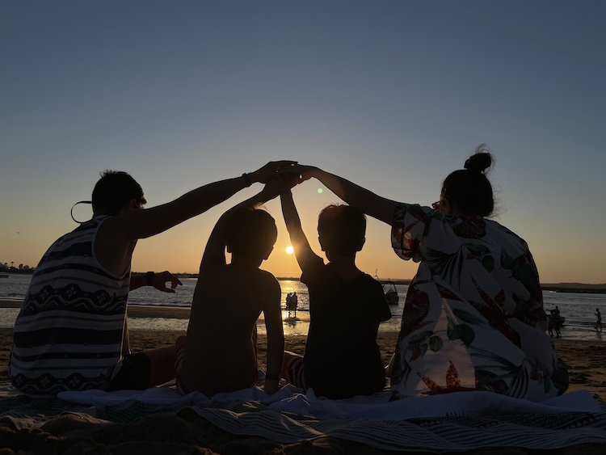
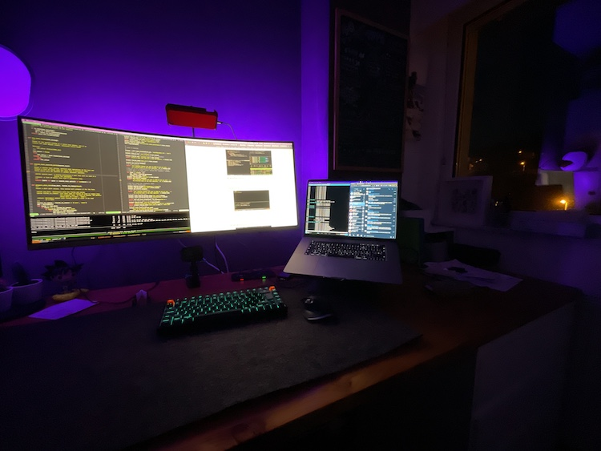
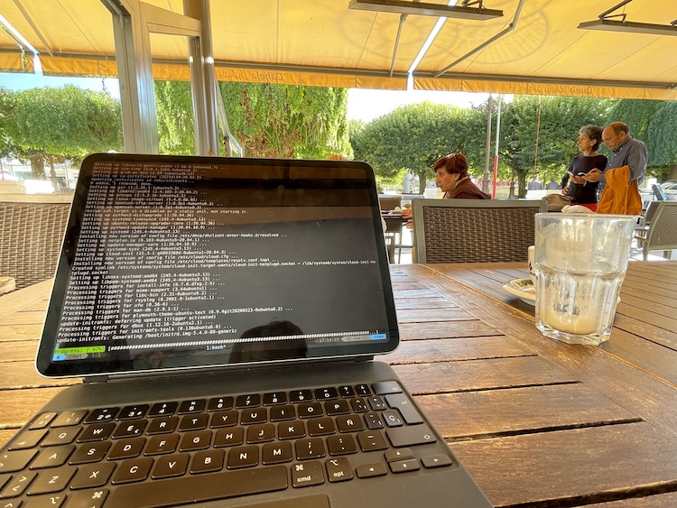
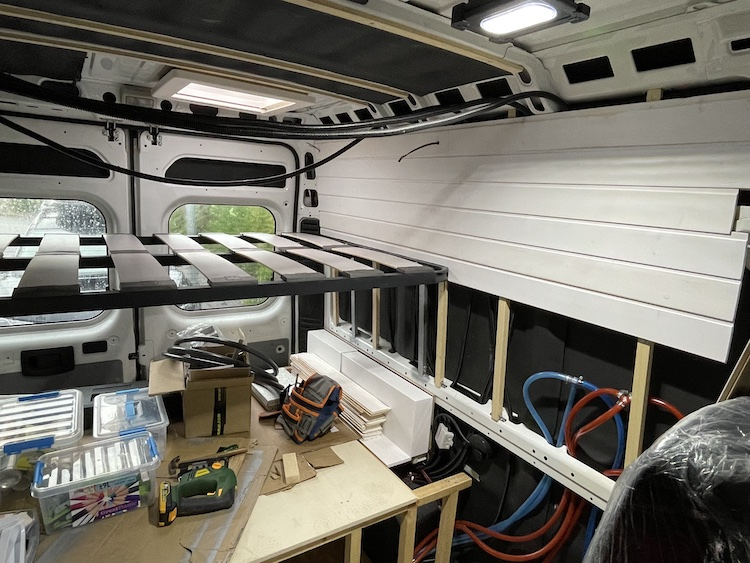

Lately I got that feeling that I needed to write again. Don't know why but probably this loneliness feeling, working from home without almost any social contact is one of the root keys.

So, did a quick tour through the photos since <a href="../../../../recently-2021-02.html">the last Recently post</a> and found that I could mention a couple of - <em>doubtful</em> interest - things...

<strong>Trips</strong>

We did lot of short trips this year. I bet that lockdown and the fear to be locked again helped a bit.

<ul>
<li>Family trip by the Galician Coast (<em>Ares</em>, <em>Coru&ntilde;a</em>, <em>Burela</em>, &nbsp;<em>Barreiros</em>). It was always a pleassure to be at the beach, even in March.</li>
<li>Couple of days here and there in summer: <em>O Grove</em>, <em>Sanxenxo</em> (<em>Pontevedra</em>), <em>Cee</em>, <em>Fisterra</em> (camping experience included), <em>Sada</em> (Coru&ntilde;a) in summer.</li>
<li>Even train was a perfect option (kids were mostly in shock) for a really quick 1-day trip to <em>Sarria</em> (a location near our place).</li>
</ul>

<strong>Twitch</strong>

As an exercise of - dunno how to say - fight against the low level of daily communication, I've started to play with Twitch and did some live sessions, mostly programming. It was the perfect excuse to have fun with <em>Rust</em> and <em>Go</em>. Now the internal fight is to be able to reach the previous month hours :). There is not so much to see but <a href="https://twitch.tv/oscarmlage">this is my account</a> just in case you feel curious about it.

<strong>Personal</strong>

<ul>
<li>My grandmother has turned 90!... but sadly due covid we couldn't celebrate it yet.</li>
<li>Did some tiny trips here and there to keep the contact with the family outdoors mostly (<em>Lagos de Teixeiro</em>, <em>Penas de Rodas</em>, lots of walks by the <em>R&iacute;o Rato</em>).</li>
<li>We've started exercising again, in a different way. We are not in mood to go to the usual gym with lot of people hardly breathing around (with and without masks), so we moved to a new place with almost individual sessions. Not as fun as the irons for me but it should work.</li>
<li>Got the 2 vaccination shots!</li>
<li>Twins won a literary contest at school!</li>
</ul>

<strong>Vanlife</strong>

Lots of advances here, we wanted to make it possible for the summer but it couldn't be, so we're now in a kind of "on-hold" state, overall process is about <em>85%</em> I'd say.

<ul>
<li>Picked the van from <em>NorthCampers</em> with all the electricty and some other stuff already done (solar panels, inverter, booster, water tanks, boiler...).</li>
<li>Done: Isolation, windows, floor, kitchen and shower furniture, beds, all the plumber stuff, electrical plugs, usbs...</li>
<li>To do: Install kitchen and shower, storage furniture, check that all works - hopefully - and get the papers.</li>
</ul>

<strong>Real Life</strong>

And meanwhile, life happens with it's ups and downs. But doesn't worth to waste words on it.

