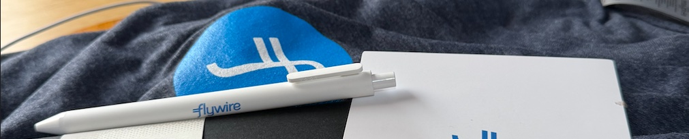

I've recently started a new professional adventure that's both exciting and overwhelming: I've "become" a Site Reliability Engineer. It's definitely a change from what I've been doing, and honestly, it feels like stepping into an appasionate world.

For years, I've been working between development and system administration: two worlds that, while related, have their own rhythms and philosophies. I was comfortable there. I knew the tools, I understood the problems, and I had my workflows pretty well established. But comfort zones, as we all know, can be tricky. They're safe, but they can also become limiting.

## 🤔 Why SRE?

Two things drew me to this change: the technical challenge and the philosophy behind SRE. I've always been curious about how large-scale systems work, how companies manage to keep services running smoothly for millions of users, and how they balance the need for innovation with the requirement for stability. SRE seemed to be at the intersection of all these questions.

The SRE philosophy resonates with me, this idea of applying Software Engineering principles to infrastructure problems, of measuring everything, of having error budgets instead of aiming for impossible 100% uptime. It's a different way of thinking about systems, and that's precisely what attracted me.

But let's be real: there's also another crucial reason. A professional opportunity came up that I simply couldn't let slip away. The kind of opportunity that doesn't come around often. And after going through the entire selection process and making it through successfully, well... how could I say no? Sometimes the universe aligns the right challenge with the right moment, and you just have to take the leap.

## 📈 The learning curve

Let me be honest: the learning curve is steep. Really steep.

Coming from dev and sys, I thought I had a solid foundation... but SRE requires a completely different mindset. It's not just about knowing how to code or how to manage servers. It's about understanding systems at scale, about **thinking in pipelines**, about automation as a first principle rather than an afterthought.

The world of **CI/CD pipelines** is fascinating but also humbling. There's so much I don't know yet. Every day I encounter new tools, new concepts, new ways of doing things that make me realize how much there is to learn. GitOps, infrastructure as code, observability patterns, deployment strategies... the list goes on.

## 😰 The impostor syndrome is real

I'd be lying if I said I haven't felt the impostor syndrome creeping in. When you make a radical career shift, especially into a role that's so different from what you've been doing, it's easy to feel like you don't belong. Like everyone else knows something you don't. Like you're constantly playing catch-up.

But here's what I'm learning to accept: that feeling is normal. It's part of the process. Every expert was once a beginner. Every SRE started somewhere, probably feeling exactly how I feel now.

## 📚 Continuous learning

If there's one thing this change has reinforced for me, it's that continuous learning isn't just a buzzword in our profession, it's a necessity. Technology evolves, methodologies change, and new challenges emerge. The moment we stop learning is the moment we start falling behind.

I'm embracing this overwhelming feeling not as a sign that I made a mistake, but as confirmation that -hopefully- I'm growing. That I'm pushing myself beyond what was comfortable.

## 🚀 Looking ahead

I don't know what the next months will bring. I'm sure there will be moments of frustration, of feeling lost, of wondering if I'll ever feel as confident in this role as I did in my previous ones. But I'm also certain there will be moments of clarity, of excitement, of that unique satisfaction that comes from understanding something that seemed impossible just days before.

For now, I'm taking it **one pipeline at a time**, one concept at a time. Learning, experimenting, failing, learning some more.

And honestly? Despite the challenges, I wouldn't have it any other way.

