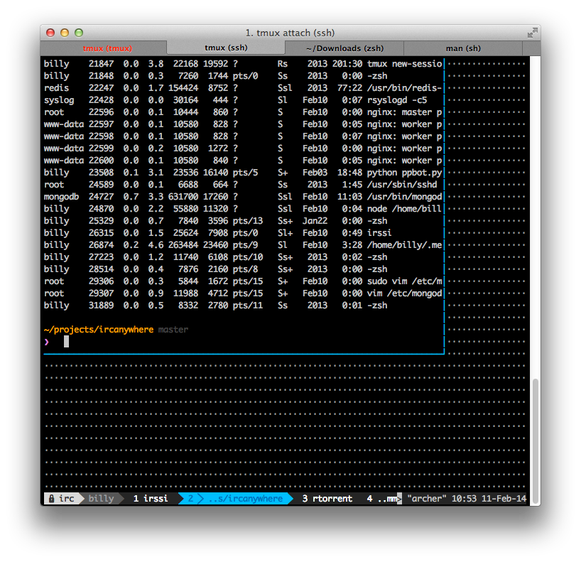
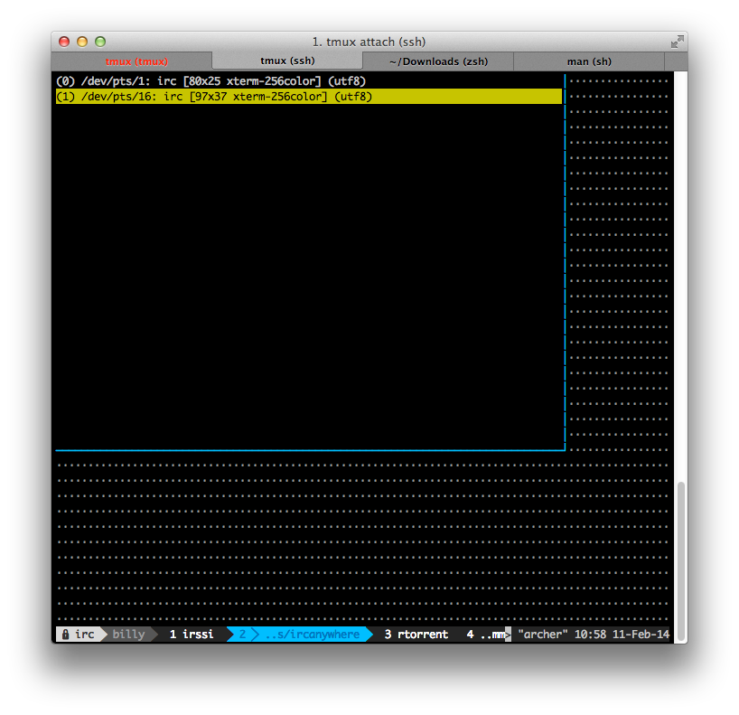

Una de las fant&aacute;ticas features de <a href="http://tmux.sourceforge.net/">tmux</a> es la sencillez con la que puedes conectar m&uacute;ltiples clientes a la misma sesi&oacute;n de forma simult&aacute;nea. Si lo has hecho alguna vez, con terminales de diferentes tama&ntilde;os, habr&aacute;s visto algo tal que as&iacute;:

Esto ocurre porque tmux muestra lo mismo a todos los clientes conectados a la sesi&oacute;n, as&iacute; que rellena los espacios libres que puedan quedar. A mi me ocurre constantemente entre distintas m&aacute;quinas conectadas a la misma sesi&oacute;n y no he encontrado de forma sencilla c&oacute;mo <em>detachear</em>&nbsp;(&iexcl;sic!, &iexcl;qu&eacute; mal suena en castellano!) otras sesiones.

As&iacute; que buscando una respuesta en las p&aacute;ginas man de tmux la respuesta es sencilla (asumiendo <code>C-b</code> como comando desencadenante de tmux): <code>C-b D</code> nos dar&iacute;a a escoger la sesi&oacute;n a la que le queremos hacer detach:

Este comando es un shortcut de <code>detach -t [target-client]</code>. Enjoy it!

Otra alternativa, si tienes tmux &gt;= 1.7 puedes ejecutar <code>tmux detach -a</code> para cargarte a todos los clientes directamente desde la linea de comandos, o si lo prefieres <code>C-b :detach -a</code>.

Y la &uacute;ltima, si solamente tienes una sesi&oacute;n y varios clientes, puedes hacer directamente&nbsp;<code>tmux attach -d</code>&nbsp;para conectarte a esa sesi&oacute;n matando el resto de posibles clientes conectados. Esta &uacute;ltima opci&oacute;n fue la que mejor funcion&oacute; en mi caso.

As&iacute; que, en resumen, he actualizado mi comando de attach a <code>tmux -u a -d</code> (utf8, attach a la &uacute;nica sesi&oacute;n que hay y detach del resto de clients que pudieran estar activos).

Art&iacute;culo original y pantallazos sacados de&nbsp;<a href="https://coderwall.com/p/vszahq">https://coderwall.com/p/vszahq</a>.

