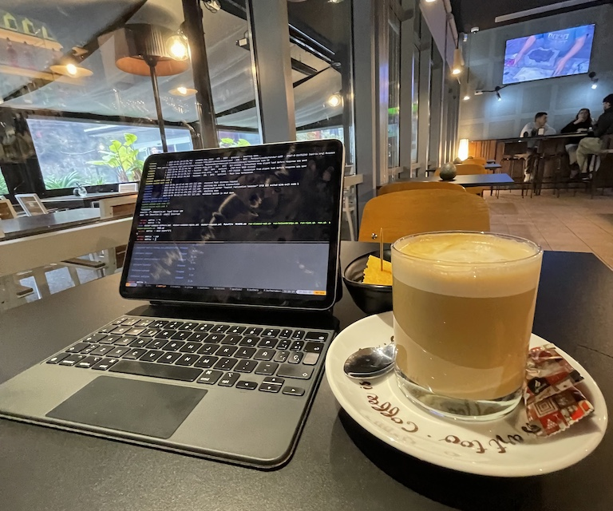

I've talked before about how much I love the form factor, versatility, portability, and battery life of the iPad. It's by far the gadget I enjoy the most.

Even for development, even when working remotely, it's ideal as long as you don't rely too much on developer tools. For backend development, it fits like a glove.

Obviously, you need access to another machine with the development environments, but as long as you don't stray too far from the terminal (`mosh`, `tmux`, `vim`...), you won't need anything more than a stable internet connection.

I've [previously mentioned](https://oscarmlage.com/posts/ipad-as-dev-machine/) how you can use a `socks server` via `SSH` in [Blink](https://blink.sh) to resolve requests on the destination host, so if we SSH into the development machine where we have [http://localproject.lc](http://localproject.lc/), the iPad can access that address.

However, although configurable in Blink, it's a somewhat tedious option as it requires a `proxy.pac` and custom configuration.

I wanted to mention another solution that involves using [Tailscale](https://tailscale.com) and its `SplitDNS` feature. As long as you can run the *Tailscale* client on both machines, the one with the development environments and the *iPad*, you can easily access all those "local" domains. Let's recap what we need:

- Development host with Tailscale client, SSHd, and a DNS server (such as dnsmasq).
- iPad with Tailscale client.

### iPad

All we have to do on the iPad is install the Tailscale client, log in with our account, and wait to have the rest configured.

### Development Host

On this host, in addition to SSH, we have the Tailscale client installed, which will give us a public IP via the Tailscale network. Additionally, we need to install and configure a DNS server (I emphasize `dnsmasq` for its ease of installation and configuration) to resolve the `.lc` domains to its Tailscale node public IP. For example, if the public IP of this node in Tailscale is `111.112.113.114`, we configure dnsmasq as follows:

```
address=/.localproject.lc/111.112.113.114
address=/.localproject2.lc/111.112.113.114
[...]
```

In addition to having the development projects running, that would be all we have to do on the development host.

### Tailscale

The last step would be to configure Tailscale. Within its `Admin console`, we should already see the nodes where we have the client installed; in our case described above, the development host and the iPad would appear.

Now we need to focus on the `DNS` option and within it on the `Nameservers`. There we can add new nameservers (`Add nameserver`) of type `Custom`:


And we would be all set to return to the iPad, log out and log back into the Tailscale client, and be able to access through the browser:


### Conclusion

With the Tailscale solution and SplitDNS feature, turning your iPad into a remote development environment becomes remarkably straightforward. By leveraging Tailscale's seamless networking capabilities and SplitDNS functionality, you can access your development environments securely and efficiently, without the need for complex configurations or resorting to workarounds like jailbreaking.

Whether you're a developer on the go or simply prefer the convenience of using your iPad for development tasks, Tailscale provides a reliable solution that empowers you to code from anywhere, effortlessly bridging the gap between your iPad and your development environment.
