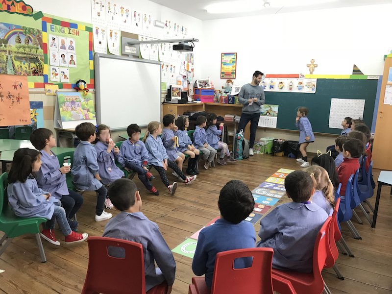
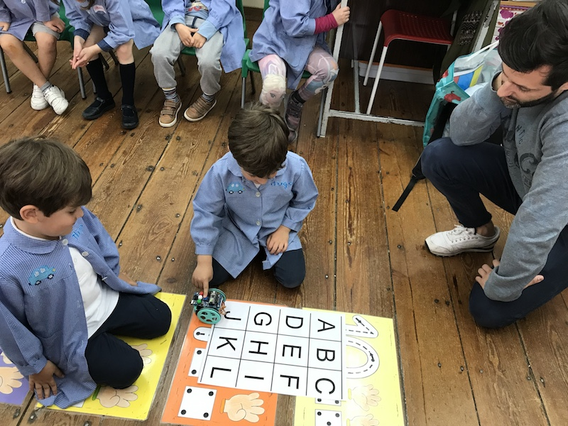

Ahora que ya ha acabado la temporada os voy a contar lo que probablemente haya sido la experiencia m&aacute;s dif&iacute;cil y placentera a la vez de este a&ntilde;o escolar 2017-2018.

Todos los a&ntilde;os a principios de curso tenemos una reuni&oacute;n padres y profesores donde nos cuentan el planteamiento que han hecho (excursiones, actuaciones, normas, etc...). Y siempre animan a los padres a involucrarse de forma activa <em>empuj&aacute;ndolos</em>&nbsp;a dar alg&uacute;n tipo de charla o taller, normalmente orientados a explicar su profesi&oacute;n.

No quer&iacute;a dejar pasar la ocasi&oacute;n de intentarlo, "<em>mejor en infantil que en primaria</em>" me dec&iacute;a. Puesto que los dos primeros a&ntilde;os volaron... era ahora o nunca.

Sab&iacute;a que encontrar&iacute;a un p&uacute;blico exigente que se aburrir&iacute;a a la primera de cambio con demasiada palabra, as&iacute; que lo mejor era plantear algunos juegos - o retos - para explicarles lo que yo hac&iacute;a. &iquest;Y c&oacute;mo explicarle a un ni&ntilde;o de 5 a&ntilde;os qu&eacute; hace un "<em>sysadmin full stack developer devop hype hype</em> [<em>ponga aqu&iacute; su buzzword</em>]" (toma casta&ntilde;a)?.

B&aacute;sicamente nos encargamos de hablar con los ordenadores &iquest;no?, darles &oacute;rdenes y comandos para que despu&eacute;s ellos hagan lo que quieran (aunque eso es otra historia). Bas&aacute;ndome en esta idea (y en alguna otra charla de <a href="https://twitter.com/david_bonilla">David Bonilla</a>, que ya pas&oacute; por esta misma experiencia), pens&eacute; que deb&iacute;a ser capaz de explicarles a los ni&ntilde;os que lo que hacemos es <strong>hablar con ordenadores</strong>.

Tambi&eacute;n quer&iacute;a transmitirles que <em>hablar con un ordenador</em>&nbsp;es algo divertido, lo que reforzaba la idea de plantear - con la ayuda de la profe - uno o varios juegos. Hice una peque&ntilde;a escaleta de lo que quer&iacute;a contar, que al final se tuvo que adaptar a lo que la clase iba demandando.

Sin ser nada original, empec&eacute; present&aacute;ntome, dici&eacute;ndoles quien era - aunque muchos de los ni&ntilde;os ya me conoc&iacute;an de ir a llevar/recoger a <em>Hugo</em> y <em>Nico</em> - y a qu&eacute; me dedicaba. Les pregunt&eacute; si sab&iacute;an lo que era un ordenador y les expliqu&eacute; un par de ideas:

<ul>
<li>Estamos rodeados de ordenadores, no s&oacute;lo son ordenadores los que ellos ven con pantalla y teclado, tambi&eacute;n hay tablets, relojes, aviones, frigor&iacute;ficos... es posible hablar con todas esas <em>cosas</em>.</li>
<li>Los ordenadores no son inteligentes, <em>s&oacute;lo</em> son r&aacute;pidos obedeciendo &oacute;rdenes, pero ellos mismos no saben qu&eacute; hacer. Hay que decirles c&oacute;mo se tienen que comportar, esa es la principal tarea del programador inform&aacute;tico: hablar con los ellos, darles &oacute;rdenes.</li>
</ul>

Y a partir de ah&iacute; nos pusimos a jugar. Ellos iban a ser programadores - y yo ordenador - por un d&iacute;a con un par de juegos.

En el primero de ellos ten&iacute;an que ponerse de acuerdo para darme instrucciones para salir de clase... en ingl&eacute;s. Coincidi&oacute; genial porque justo la clase anterior hab&iacute;a sido ingl&eacute;s. As&iacute; que el ordenador - yo - s&oacute;lo entend&iacute;a cuatro palabras "<em>up</em>", "<em>down</em>", "<em>left</em>" y "<em>right</em>". Chocar con las mesas y con la pared fue gracioso.

En el segundo juego les expliqu&eacute; que los ordenadores realmente no entend&iacute;an ingl&eacute;s, s&oacute;lo entend&iacute;an ceros y unos, as&iacute; que les plante&eacute; el mismo juego pero s&oacute;lo pod&iacute;an decir ceros y unos. Se quedaron un poco despistados hasta que dibuj&eacute; la t&iacute;pica cruceta de flechas: <code>(1,1)</code> up, <code>(0,0)</code> down, <code>(1,0)</code> left, <code>(0,1)</code> right. Y me sorprendieron entendi&eacute;ndolo a la primera. Programaron perfectamente las instrucciones para hacer que el robot abandonara la clase.

&iexcl;Ya estaban preparados para hablar con ordenadores de verdad!, as&iacute; que les present&eacute; a los <a href="http://escornabot.com/web/">escornabots</a>, un par de amigos que hab&iacute;an venido dispuestos a ser programados por ellos. Se quedaron ojipl&aacute;ticos. Estuvieron jugando con ellos incluso en tiempo de recreo. No tuve tiempo a mucho m&aacute;s, los robots fueron las verdaderas <em>estrellas</em>&nbsp;de la charla.

He aprovechado la experiencia para hacer varias lecturas. A los ni&ntilde;os, una generaci&oacute;n completamente digital y m&aacute;s preparada para la revoluci&oacute;n tecnol&oacute;gica de lo que pensamos, les encantan los robots. A los padres tambi&eacute;n les encanta que sus hijos sientan curiosidad por la tecnolog&iacute;a. Y a los profesores tambi&eacute;n, pese a que muchas veces no tengan medios, conocimientos o tiempo suficientes para introducir m&aacute;s experiencias similares.

A todos los padres que os encontr&eacute;is en una situaci&oacute;n similar y no os decid&aacute;is a ir, ni os plante&eacute;is perderos la experiencia. Los profesores os van a ayudar en todo lo que puedan. Por cierto, antes de seguir quisiera agradecer a la profe <em>Ana</em> su ayuda y la infinita paciencia que tiene con los peques.&nbsp;

En lo particular, ninguno de mis hijos ha dicho nunca que le gustar&iacute;a dedicarse a lo mismo que yo (lo cual no me preocupa ni lo m&aacute;s m&iacute;nimo), ellos son m&aacute;s de polic&iacute;as y bomberos. Pero creo que, por un momento, se han sentido orgullosos de lo que su padre les ha ido a contar al cole, porque al acabar la charla se acercaron y me dijeron al o&iacute;do algo que no voy a olvidar nunca:

"<strong>Ha sido una fant&aacute;stica idea que hayas venido, ha sido lo mejor</strong>"

