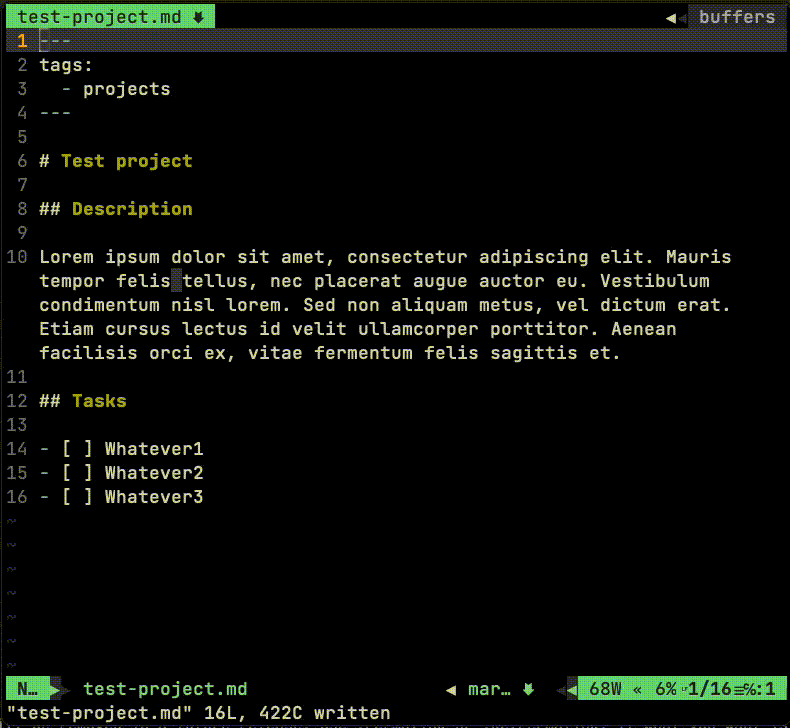

I tent to automate things as much as I can and in that automation proccess I enjoy using pieces of software here and there that helps me to be more agile/fast. One of that pieces of software that I really appreciate is [Obsidian](https://obsidian.md) because it makes some things easier than *others*.

But most of the time is a bit overkill to have all that Electron stuff doing nothing but eating RAM in background while on the other hand there are always some instances of [vim](https://www.vim.org) / [neovim](https://neovim.io) running on my computer. They're just plain markdown files stored somewhere in the hard disk, aren't they?.

One of the features that I love is the [Obsidian Tasks Plugin](https://github.com/schemar/obsidian-tasks), that tracks lists of tasks across the entire vault and manages really well the dates and the filtering. When I start a project (or a complex task) I'm used to write down all the tasks and subtasks that need to be done in a markdown file, once moving forward with the project the tasks are being marked as done, and the `obsidian-task-plugin` adds the date on the side. Then you can use that date to filter by day across all your projects in order to know all the tasks of the day, week, month, etc...

My desire is to be able to do that marking in same exact way but using `vim`, because - for me - it's faster. Then, for a reviewing process (the day, the week...) it's more friendly to open `Obsidian`, but that's another story.

So, let's play with vim keybindings in our .vim config:

```yml
nnoremap <Leader><Enter> :norm 0<CR>:.s/\[ ]/\[x]/g<CR>:.s/$/ ✅ /g<CR>:.s/$/\=strftime("%Y-%m-%d")/g<CR>:nohl<CR>
nnoremap <Leader>w :norm 0<CR>:.s/\[ ]/\[ ] 🚧️/g<CR>:nohl<CR>
```

If I press `<Leader><Enter>` the task is marked as done. And for the same price I've added `<Leader>w` to mark the task visually as WIP *work-in-proccess* with the nice hoarding emoji. And that's how it looks like in `vim`:



And with this tip and a little time inversion, as I don't need to open *Obsidian*, I feel myself more concentrated using the same tool for writing code and managing tasks.
