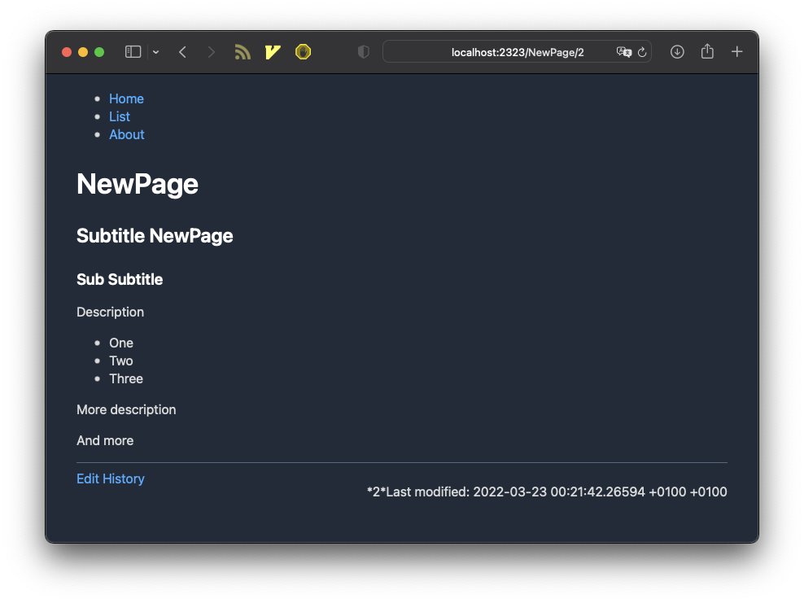

After reading some stuff here and there, playing around with the new shinny languages that seems to be the fashion ones nowadays and thinking so much about "what's next", my friend [Juanjo](https://www.usebox.net) friendly *pushed* me to write something with real specs in... [Go](https://go.dev).

I've been working for years with *PHP* and - still - *Python* but lately I'm really tempted to test the smell of compile things again, care about typed variables and think different regarding to data structures, etc...

Long time ago - when studying - I had to learn *C* and *afaik* it is imposible to travel in time yet... so in a way, wanted to come back to that days and compare feelings. That's how [Wikingo](https://github.com/oscarmlage/wikingo) is born, a minimal personal wiki written in Go:

* Write your stuff in Markdown, `wikingo` will parse it to HTML with [Blackfriday](https://github.com/russross/blackfriday).
* Storage initially is built on top of `sqlite` with [Gorm](https://gorm.io/), but the thing is to be able to provide different storages (would like to add plain files storage too).
* Templates are being rendered via [html/template](https://pkg.go.dev/html/template) standard library.
* [Echo](https://echo.labstack.com/) is the HTTP server.

And not much more to say, it's the tipical *side-project* that leads you to start learning and practicing a new programming language. If you like to take a look to [the repo](https://github.com/oscarmlage/wikingo) and contribute in a way, I'll be so glad!.
